# Rabbit YouTube Analytics Platform - Documentation

## Overview

Welcome to the comprehensive documentation for the Rabbit YouTube Analytics Platform. This documentation provides detailed information about the system architecture, services, development processes, and deployment strategies.

## Documentation Structure

```mermaid
graph TB
    subgraph "📚 Documentation Categories"
        ARCH[🏗️ Architecture]
        SERVICES[⚙️ Services]
        DEV[💻 Development]
        MODELS[📊 Models]
        INTEGRATIONS[🔗 Integrations]
        LLM[🤖 LLM Context]
    end
    
    subgraph "🎯 User Roles"
        DEVELOPERS[Developers]
        ARCHITECTS[System Architects]
        DEVOPS[DevOps Engineers]
        ANALYSTS[Data Analysts]
        LLMS[LLM Systems]
    end
    
    DEVELOPERS --> DEV
    DEVELOPERS --> SERVICES
    ARCHITECTS --> ARCH
    ARCHITECTS --> MODELS
    DEVOPS --> DEV
    DEVOPS --> INTEGRATIONS
    ANALYSTS --> MODELS
    ANALYSTS --> SERVICES
    LLMS --> LLM
    
    style ARCH fill:#e3f2fd
    style SERVICES fill:#f3e5f5
    style DEV fill:#e8f5e8
    style LLM fill:#fff3e0
```

## Quick Navigation

### 🚀 Getting Started
- **New Developers**: Start with [Getting Started Guide](development/getting-started.md)
- **System Overview**: Read [System Architecture Overview](architecture/system-overview.md)
- **LLM Integration**: Begin with [Codebase Summary](llm-context/codebase-summary.md)

### 📖 Documentation Categories

#### 🏗️ Architecture Documentation
Comprehensive system design and architectural patterns.

| Document | Description | Audience |
|----------|-------------|----------|
| [System Overview](architecture/system-overview.md) | High-level architecture with Mermaid diagrams | Architects, Developers |
| [Data Flow](architecture/data-flow.md) | Data processing pipelines and transformations | Architects, Developers |
| [Service Dependencies](architecture/service-dependencies.md) | Service interaction patterns and dependencies | Developers, DevOps |
| [API Design](architecture/api-design.md) | REST API design principles and documentation | Frontend Developers, API Users |

#### ⚙️ Service Documentation
Detailed documentation for each service component.

| Document | Description | Audience |
|----------|-------------|----------|
| [Analytics Service](services/analytics-service.md) | Metrics generation algorithms and calculations | Developers, Analysts |
| [Parser Service](services/parser-service.md) | HTML parsing and orchestration logic | Developers |
| [Enrichment Services](services/enrichment-services.md) | Data enrichment strategies and implementations | Developers |
| [Video Service](services/video-service.md) | Database operations and data management | Developers |
| [Classifier Service](services/classifier-service.md) | Content classification logic | Developers |

#### 💻 Development Guides
Practical guides for development and contribution.

| Document | Description | Audience |
|----------|-------------|----------|
| [Getting Started](development/getting-started.md) | Complete setup and development environment | New Developers |
| [Testing Strategy](development/testing-strategy.md) | Testing approaches and best practices | Developers |
| [Deployment Guide](development/deployment-guide.md) | Production deployment and scaling | DevOps, Developers |
| [Performance Optimization](development/performance-optimization.md) | Performance tuning and optimization | Senior Developers |

#### 📊 Data Models
Data structures and schema documentation.

| Document | Description | Audience |
|----------|-------------|----------|
| [VideoEntry Schema](models/video-entry-schema.md) | Complete VideoEntry model documentation | Developers, Analysts |
| [Metrics Schema](models/metrics-schema.md) | Analytics and metrics data structures | Developers, Analysts |
| [API Contracts](models/api-contracts.md) | Request/response schemas and validation | API Users, Developers |

#### 🔗 Integration Documentation
External integrations and connection guides.

| Document | Description | Audience |
|----------|-------------|----------|
| [YouTube API Integration](integrations/youtube-api-integration.md) | YouTube Data API usage and best practices | Developers |
| [Database Design](integrations/database-design.md) | MongoDB schema design and indexing | Developers, DBAs |
| [Frontend-Backend Integration](integrations/frontend-backend-integration.md) | API contracts and communication patterns | Full-stack Developers |

#### 🤖 LLM Context
Documentation optimized for LLM understanding and integration.

| Document | Description | Audience |
|----------|-------------|----------|
| [Codebase Summary](llm-context/codebase-summary.md) | Executive summary for LLM systems | LLM Systems, AI Tools |
| [Key Patterns](llm-context/key-patterns.md) | Common patterns and conventions | LLM Systems, Developers |
| [Troubleshooting Guide](llm-context/troubleshooting-guide.md) | Common issues and resolution patterns | Support, LLM Systems |
| [Extension Points](llm-context/extension-points.md) | How to extend functionality safely | LLM Systems, Developers |

## 🎯 Role-Based Documentation Paths

### For New Developers

**Recommended Reading Order:**
1. [Getting Started Guide](development/getting-started.md) - Environment setup
2. [System Architecture Overview](architecture/system-overview.md) - Understanding the platform
3. [Codebase Summary](llm-context/codebase-summary.md) - High-level code overview
4. [Analytics Service](services/analytics-service.md) - Core business logic
5. [Testing Strategy](development/testing-strategy.md) - Quality assurance

### For System Architects

**Recommended Reading Order:**
1. [System Architecture Overview](architecture/system-overview.md)
2. [Data Flow](architecture/data-flow.md)
3. [Service Dependencies](architecture/service-dependencies.md)
4. [Performance Optimization](development/performance-optimization.md)
5. [Database Design](integrations/database-design.md)

### For DevOps Engineers

**Recommended Reading Order:**
1. [Getting Started Guide](development/getting-started.md) - Local setup
2. [Deployment Guide](development/deployment-guide.md) - Production deployment
3. [Performance Optimization](development/performance-optimization.md) - Scaling strategies
4. [Database Design](integrations/database-design.md) - Data layer setup
5. [System Architecture Overview](architecture/system-overview.md) - Infrastructure understanding

### For LLM Integration

**Recommended Reading Order:**
1. [Codebase Summary](llm-context/codebase-summary.md) - Complete platform overview
2. [Key Patterns](llm-context/key-patterns.md) - Development conventions
3. [API Contracts](models/api-contracts.md) - Interface definitions
4. [Extension Points](llm-context/extension-points.md) - Customization opportunities
5. [Troubleshooting Guide](llm-context/troubleshooting-guide.md) - Problem resolution

## 🔍 Find What You Need

### By Technology
- **TypeScript/Node.js**: [Service Documentation](services/)
- **React/Next.js**: [Frontend-Backend Integration](integrations/frontend-backend-integration.md)
- **MongoDB**: [Database Design](integrations/database-design.md)
- **YouTube API**: [YouTube API Integration](integrations/youtube-api-integration.md)
- **Docker**: [Getting Started](development/getting-started.md) + [Deployment Guide](development/deployment-guide.md)

### By Feature
- **Analytics Engine**: [Analytics Service](services/analytics-service.md)
- **Data Processing**: [Parser Service](services/parser-service.md)
- **Data Enrichment**: [Enrichment Services](services/enrichment-services.md)
- **Performance**: [Performance Optimization](development/performance-optimization.md)
- **Testing**: [Testing Strategy](development/testing-strategy.md)

### By Problem
- **Setup Issues**: [Getting Started Guide](development/getting-started.md)
- **Performance Problems**: [Performance Optimization](development/performance-optimization.md)
- **Integration Issues**: [Integration Documentation](integrations/)
- **API Questions**: [API Design](architecture/api-design.md)
- **Data Questions**: [Data Models](models/)

## 📋 Documentation Standards

### Mermaid Diagram Standards
All diagrams follow consistent styling:
- **Blue (#e3f2fd)**: Input/Starting points
- **Green (#e8f5e8)**: Output/Success states
- **Purple (#f3e5f5)**: Processing/Services
- **Orange (#fff3e0)**: External systems
- **Red (#ffebee)**: Errors/Failures

### Code Example Standards
- **TypeScript**: Full type annotations
- **Comments**: Explain business logic, not syntax
- **Error Handling**: Show comprehensive error scenarios
- **Performance**: Include optimization notes

### Documentation Updates
When updating documentation:
1. **Keep diagrams current** with code changes
2. **Update cross-references** when adding new docs
3. **Maintain consistency** in terminology and patterns
4. **Test code examples** for accuracy
5. **Update this index** when adding new documentation

## 🤝 Contributing to Documentation

### Documentation Types Needed
- **API Examples**: Real-world usage examples
- **Performance Benchmarks**: Concrete performance data
- **Troubleshooting Scenarios**: Common problem-solution pairs
- **Integration Tutorials**: Step-by-step integration guides
- **Architecture Decision Records**: Design choice rationale

### Style Guide
- **Clarity**: Write for your audience's expertise level
- **Completeness**: Include all necessary context
- **Currency**: Keep information up-to-date
- **Cross-references**: Link to related documentation
- **Examples**: Provide concrete, testable examples

## 📞 Support and Questions

### For Developers
- **Code Questions**: Check [Service Documentation](services/)
- **Setup Issues**: See [Getting Started Guide](development/getting-started.md)
- **Architecture Questions**: Review [Architecture Documentation](architecture/)

### For System Integrators
- **API Integration**: See [API Design](architecture/api-design.md)
- **Data Integration**: Check [Integration Documentation](integrations/)
- **Performance Requirements**: Review [Performance Optimization](development/performance-optimization.md)

### For LLM Systems
- **Code Understanding**: Start with [Codebase Summary](llm-context/codebase-summary.md)
- **Pattern Recognition**: See [Key Patterns](llm-context/key-patterns.md)
- **Extension Development**: Check [Extension Points](llm-context/extension-points.md)

---

This documentation represents a comprehensive guide to understanding, developing, and deploying the Rabbit YouTube Analytics Platform. Whether you're a developer, architect, or AI system, you'll find the information needed to work effectively with this platform.