# API Design Documentation

## Overview

The Rabbit YouTube Analytics Platform exposes a comprehensive REST API that follows modern design principles and provides a consistent interface for data processing, analytics generation, and system management.

## API Endpoint Structure

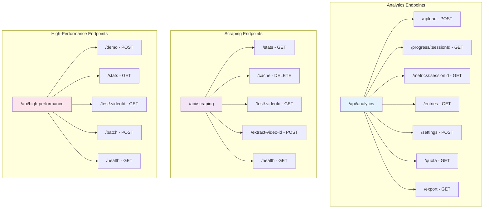

## Request/Response Flow

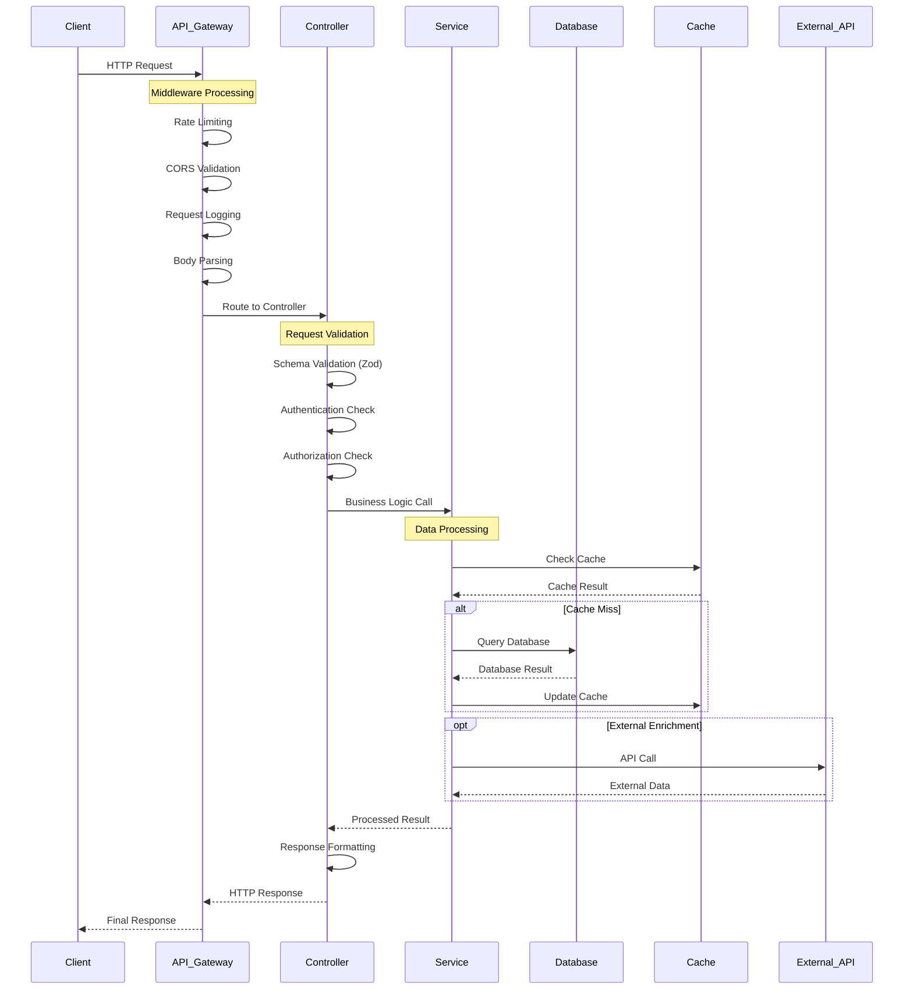

## Analytics API Endpoints

### Upload Endpoint

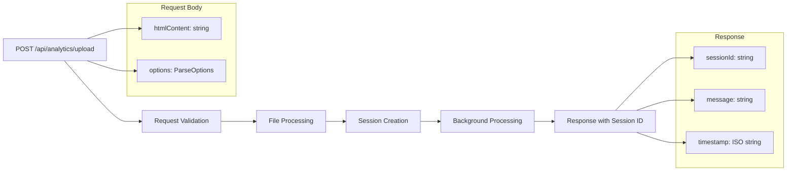

#### Request Schema
```typescript
interface UploadRequest {
  htmlContent: string;
  options: {
    enrichWithAPI: boolean;
    useScrapingService: boolean;
    useHighPerformanceService: boolean;
    forceReprocessing: boolean;
    includeAds: boolean;
    includeShorts: boolean;
    dateRange?: {
      start: string; // ISO date
      end: string;   // ISO date
    };
    categoryFilters?: string[];
  };
}
```

#### Response Schema
```typescript
interface UploadResponse {
  success: boolean;
  sessionId: string;
  message: string;
  timestamp: string;
  estimatedProcessingTime?: number;
}
```

### Progress Tracking Endpoint

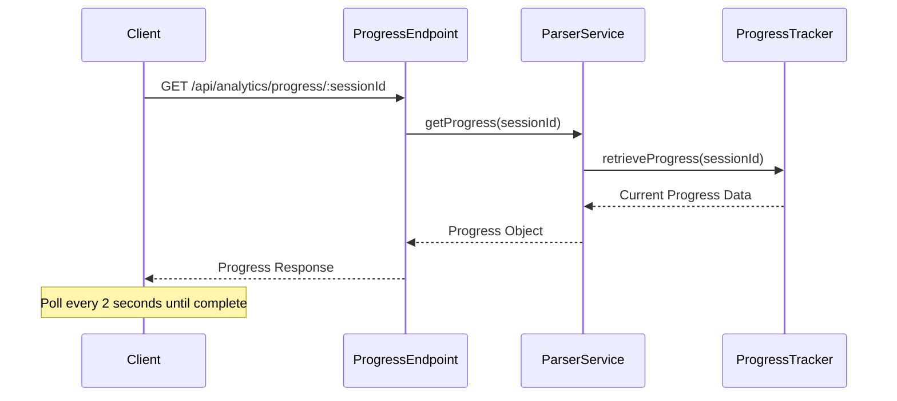

#### Progress Response Schema
```typescript
interface ProgressResponse {
  success: boolean;
  progress: {
    sessionId: string;
    stage: string;
    progress: number; // 0-100
    message: string;
    details: {
      totalEntries?: number;
      processedEntries?: number;
      enrichedEntries?: number;
      errors?: number;
    };
    isComplete: boolean;
    error?: string;
  };
  timestamp: string;
}
```

### Metrics Endpoint

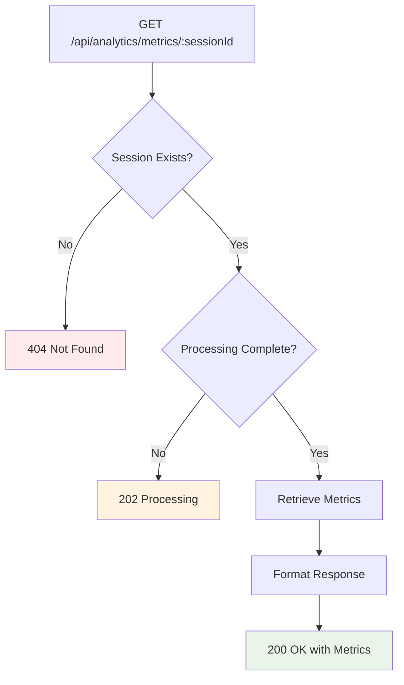

#### Metrics Response Schema
```typescript
interface MetricsResponse {
  success: boolean;
  metrics: VideoMetrics;
  processingStats: {
    totalEntries: number;
    validEntries: number;
    duplicatesRemoved: number;
    errors: string[];
    processingTime: number;
  };
  timestamp: string;
}
```

### Entries Query Endpoint

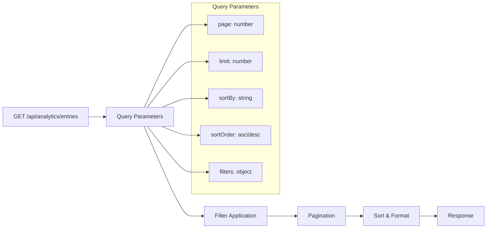

#### Query Parameters Schema
```typescript
interface EntriesQuery {
  page?: number;
  limit?: number;
  sortBy?: 'watchedAt' | 'title' | 'channel' | 'duration';
  sortOrder?: 'asc' | 'desc';
  filters?: {
    channel?: string;
    category?: VideoCategory;
    contentType?: ContentType;
    dateRange?: {
      start: string;
      end: string;
    };
    searchTerm?: string;
  };
}
```

## Scraping API Endpoints

### Statistics Endpoint

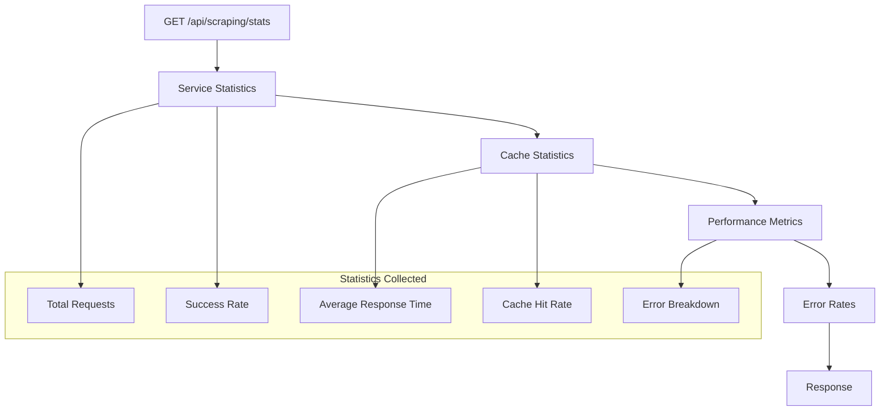

#### Statistics Response Schema
```typescript
interface ScrapingStatsResponse {
  success: boolean;
  stats: {
    totalRequests: number;
    successfulRequests: number;
    failedRequests: number;
    successRate: number;
    averageResponseTime: number;
    cacheStats: {
      hits: number;
      misses: number;
      hitRate: number;
      totalKeys: number;
    };
    errorBreakdown: Record<string, number>;
    lastReset: string;
  };
  timestamp: string;
}
```

### Video Testing Endpoint

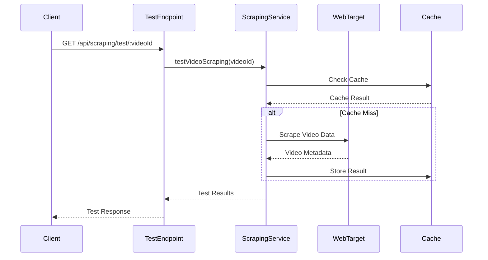

## High-Performance API Endpoints

### Demo Endpoint

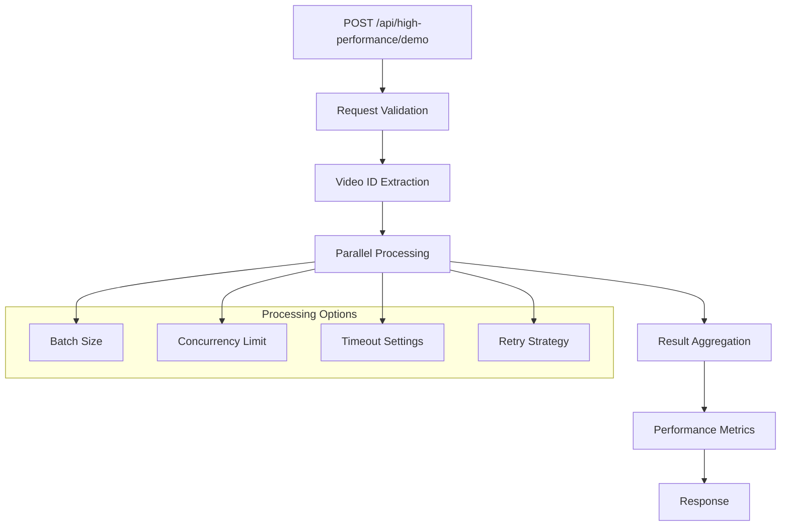

#### Demo Request Schema
```typescript
interface HighPerformanceDemoRequest {
  videoIds: string[];
  options?: {
    batchSize?: number;
    concurrencyLimit?: number;
    timeoutMs?: number;
    retryAttempts?: number;
    enableCaching?: boolean;
  };
}
```

## Error Handling Design

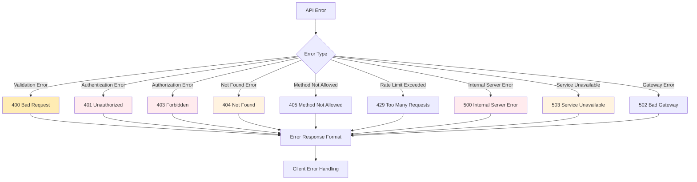

### Standard Error Response Format
```typescript
interface ErrorResponse {
  error: string;
  message: string;
  statusCode: number;
  timestamp: string;
  path?: string;
  details?: {
    field?: string;
    code?: string;
    constraint?: string;
  };
  requestId?: string;
}
```

## Authentication & Authorization Flow

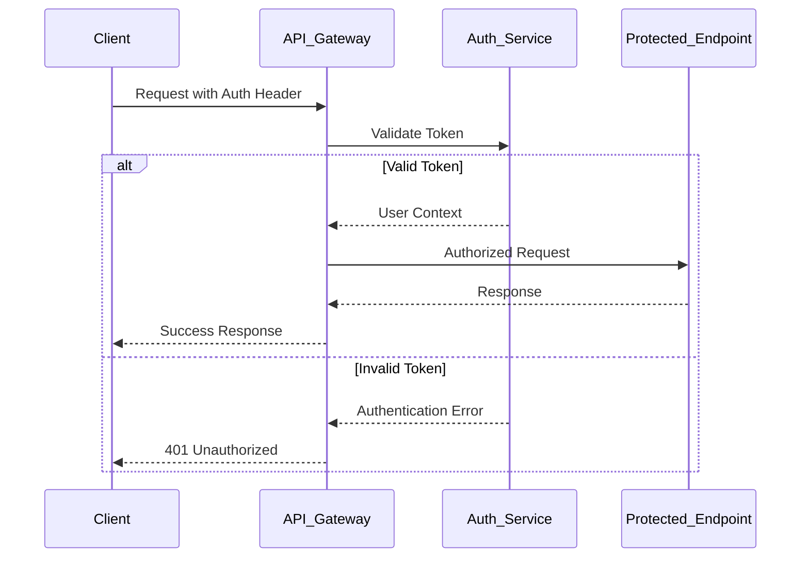

## Rate Limiting Strategy

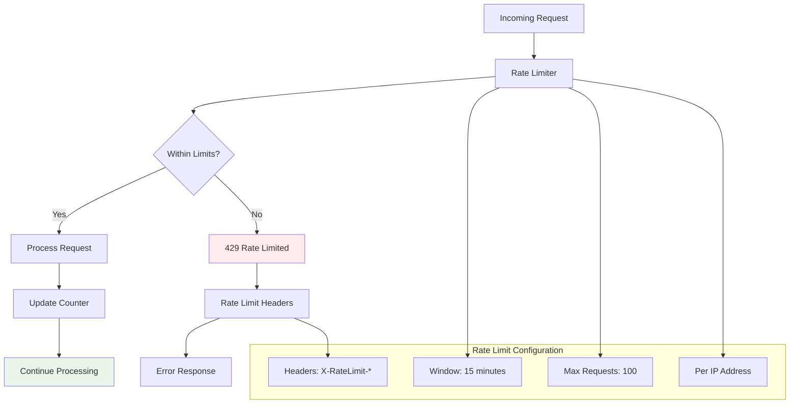

## API Versioning Strategy

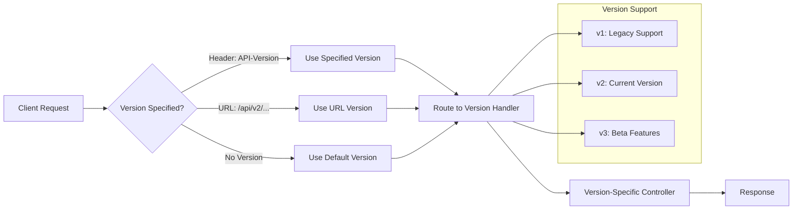

## Content Negotiation

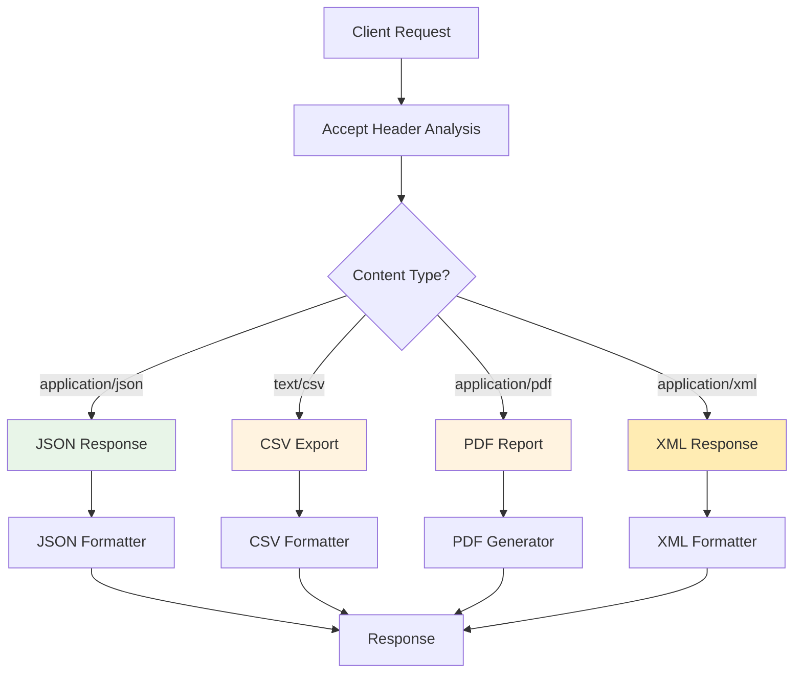

## Performance Monitoring

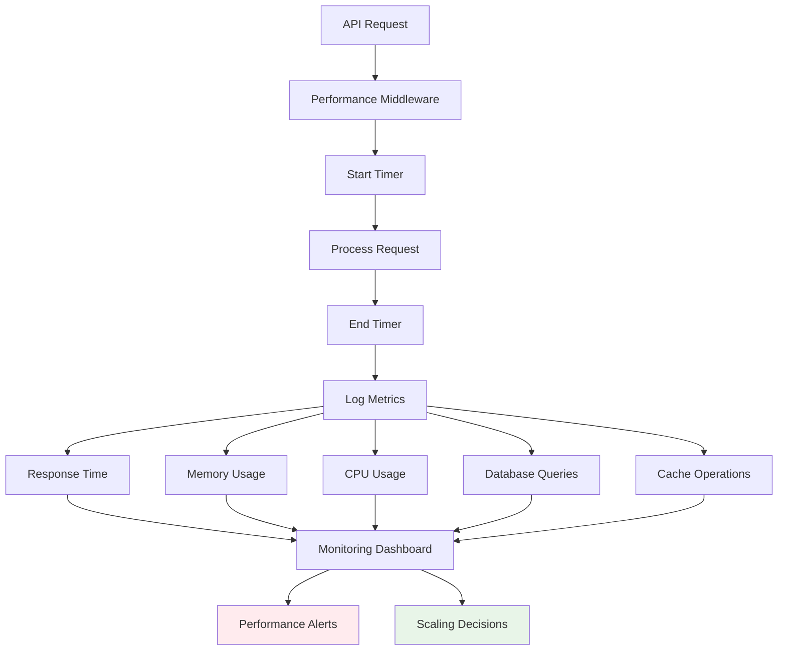

## API Documentation Standards

### OpenAPI Specification
- **Schema Definitions**: Complete request/response schemas
- **Authentication**: Security scheme documentation
- **Examples**: Real-world request/response examples
- **Error Codes**: Comprehensive error documentation

### Best Practices
- **Consistent Naming**: camelCase for JSON properties
- **Resource Naming**: Plural nouns for collections
- **HTTP Methods**: Semantic HTTP verb usage
- **Status Codes**: Appropriate HTTP status codes
- **Idempotency**: Safe operations for GET, PUT, DELETE

This API design provides a robust, scalable, and developer-friendly interface that follows REST principles while supporting the complex data processing requirements of the YouTube Analytics Platform.