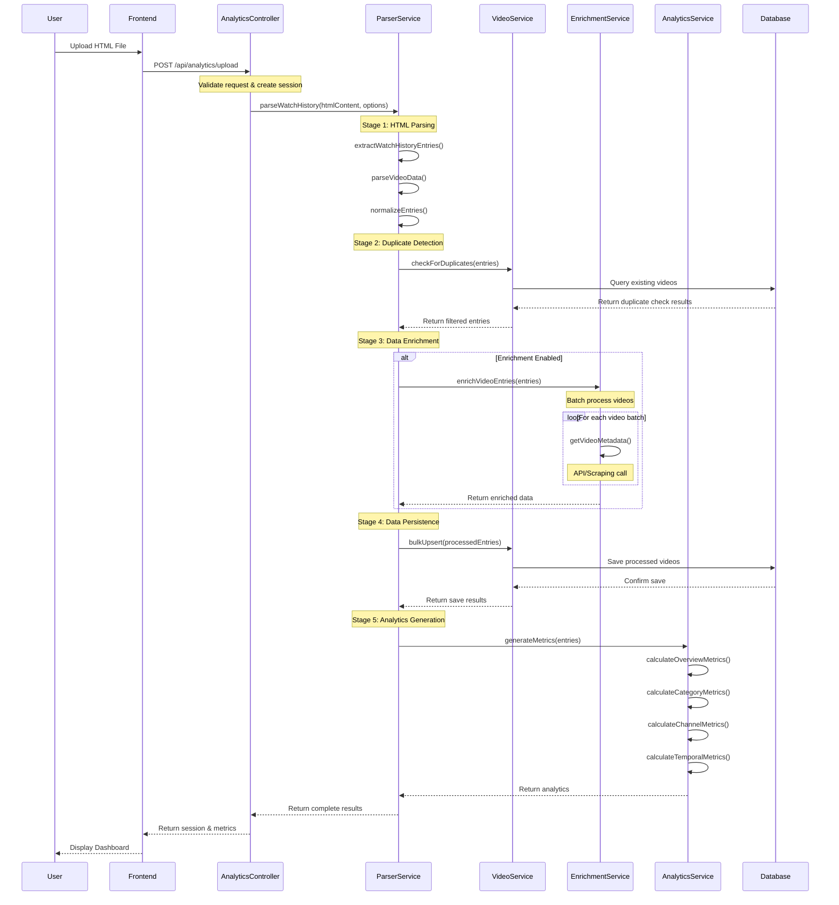
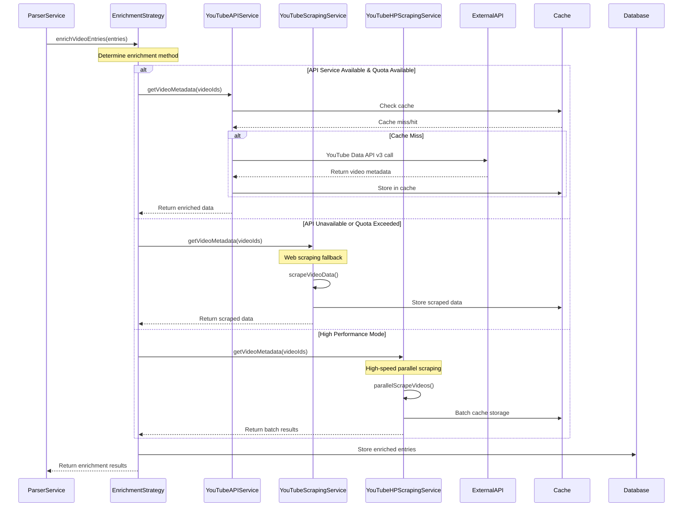
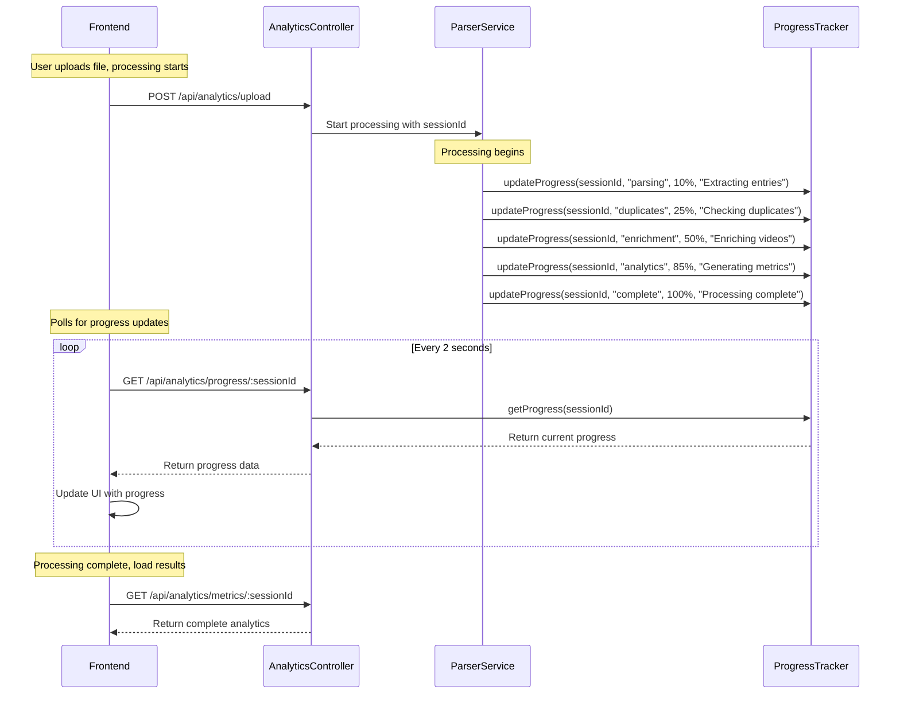
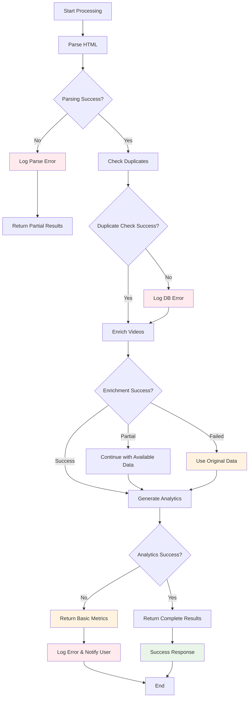
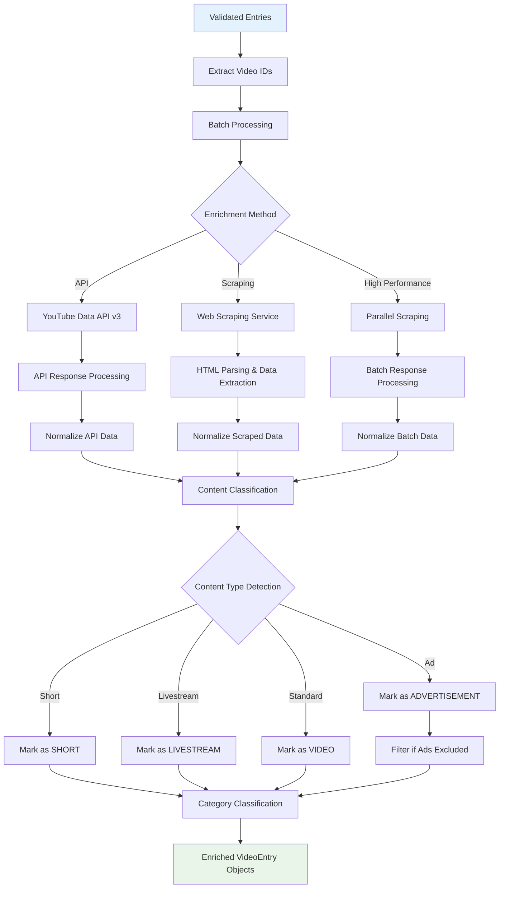
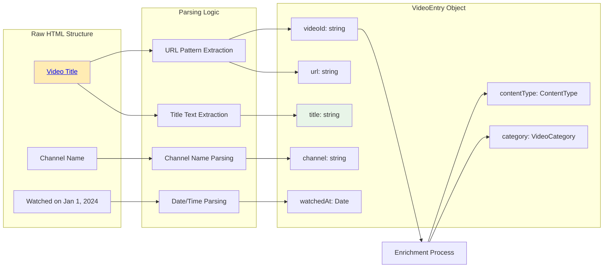
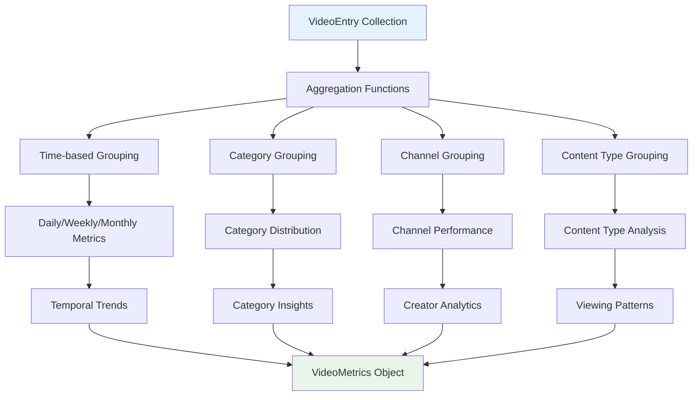

# Data Processing Flow

## Overview

The Rabbit YouTube Analytics Platform processes YouTube watch history data through a sophisticated ETL (Extract, Transform, Load) pipeline that enriches raw HTML data with metadata from multiple sources and generates comprehensive analytics.

## Primary Data Processing Flow

## Enrichment Service Flow

## Real-time Progress Tracking

## Error Handling and Recovery Flow

## Data Transformation Pipeline

### Stage 1: HTML Parsing and Extraction

```mermaid
flowchart LR
    A[Raw HTML Content] --> B[Regex Pattern Matching]
    B --> C[Extract Watch History Entries]
    C --> D[Parse Video URLs]
    D --> E[Extract Timestamps]
    E --> F[Normalize Channel Names]
    F --> G[Initial VideoEntry Objects]
    
    subgraph "Validation"
        H[Validate Required Fields]
        I[Filter Invalid Entries]
        J[Apply Date Range Filters]
    end
    
    G --> H
    H --> I
    I --> J
    J --> K[Validated Entries]
    
    style A fill:#e3f2fd
    style K fill:#e8f5e8
```

### Stage 2: Data Enrichment and Classification

### Stage 3: Analytics Generation

```mermaid
flowchart TB
    A[Enriched Video Entries] --> B[Overview Metrics Calculation]
    A --> C[Content Type Distribution]
    A --> D[Category Analysis]
    A --> E[Channel Metrics]
    A --> F[Temporal Analysis]
    A --> G[Discovery Patterns]
    A --> H[Trend Analysis]
    
    B --> I[Total Watch Time]
    B --> J[Video Count]
    B --> K[Date Range Analysis]
    
    C --> L[Video vs Shorts vs Ads]
    D --> M[Top Categories by Time]
    D --> N[Category Trends]
    
    E --> O[Top Channels]
    E --> P[Channel Engagement]
    E --> Q[Subscription Analysis]
    
    F --> R[Hourly Patterns]
    F --> S[Daily Patterns]
    F --> T[Seasonal Trends]
    
    G --> U[Discovery Methods]
    G --> V[Content Completion Rates]
    
    H --> W[Month-over-Month Growth]
    H --> X[Year-over-Year Comparison]
    
    I --> Y[Comprehensive Metrics Object]
    J --> Y
    K --> Y
    L --> Y
    M --> Y
    N --> Y
    O --> Y
    P --> Y
    Q --> Y
    R --> Y
    S --> Y
    T --> Y
    U --> Y
    V --> Y
    W --> Y
    X --> Y
    
    style A fill:#e3f2fd
    style Y fill:#e8f5e8
```

## Data Model Transformations

### Raw HTML → VideoEntry

### VideoEntry → Analytics Metrics

## Performance Optimization Strategies

### 1. Batch Processing
- **Video Enrichment**: Process videos in batches of 50
- **Database Operations**: Bulk insert/update operations
- **API Calls**: Batch YouTube API requests

### 2. Caching Strategy
- **Redis Caching**: Cache enriched video metadata
- **Memory Caching**: Cache frequently accessed data
- **TTL Management**: Automatic cache expiration

### 3. Parallel Processing
- **Concurrent Enrichment**: Multiple enrichment streams
- **Promise Pooling**: Limit concurrent operations
- **Resource Management**: CPU and memory optimization

### 4. Database Optimization
- **Indexing**: Optimized queries with proper indexes
- **Connection Pooling**: Efficient database connections
- **Query Optimization**: Minimize database round-trips

This data flow architecture ensures efficient, reliable, and scalable processing of YouTube watch history data while providing real-time feedback to users and comprehensive error handling throughout the pipeline.