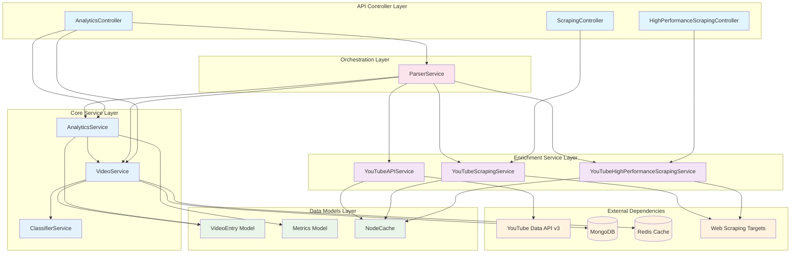
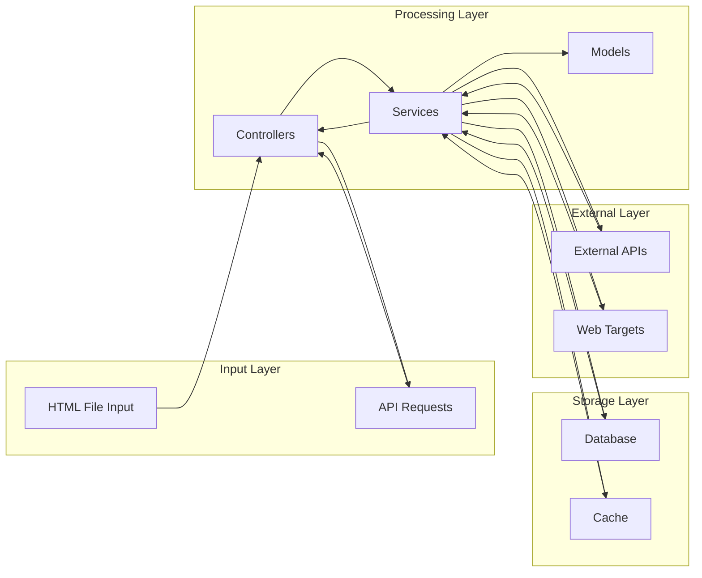
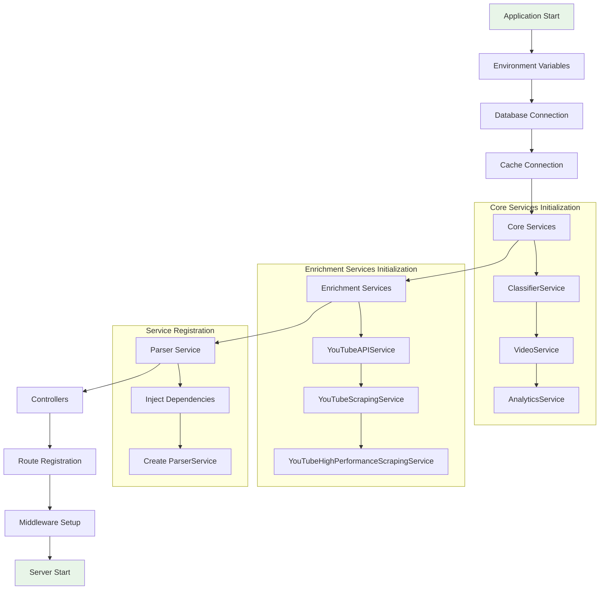
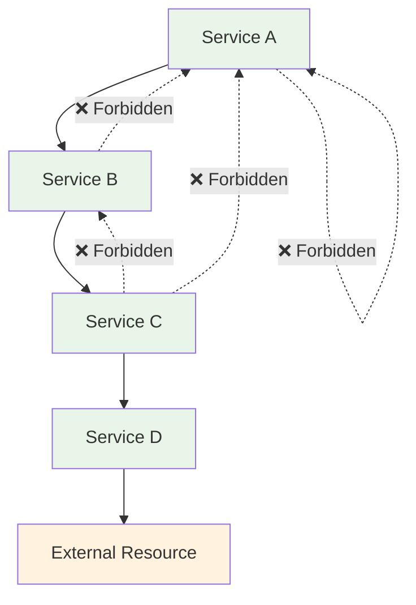
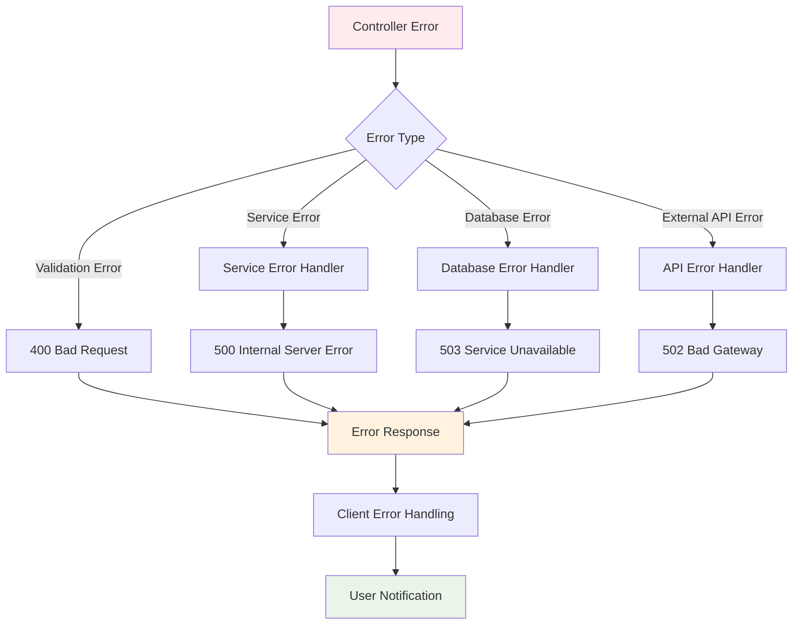

# Service Dependencies Map

## Overview

The Rabbit YouTube Analytics Platform follows a layered service architecture with clear separation of concerns and well-defined dependencies. This document outlines the relationships between services, models, and external systems.

## Service Dependency Hierarchy



## Detailed Service Dependencies

### ParserService Dependencies

```mermaid
graph TD
    PARSER[ParserService] --> VIDEO_SVC[VideoService]
    PARSER --> ANALYTICS_SVC[AnalyticsService]
    PARSER --> YT_API_SVC[YouTubeAPIService]
    PARSER --> YT_SCRAPING_SVC[YouTubeScrapingService]
    PARSER --> YT_HP_SCRAPING_SVC[YouTubeHighPerformanceScrapingService]
    
    subgraph "ParserService Core Functions"
        PARSE_HTML[parseWatchHistory()]
        EXTRACT_ENTRIES[extractWatchHistoryEntries()]
        ENRICH_VIDEOS[enrichVideoEntries()]
        TRACK_PROGRESS[updateProgress()]
    end
    
    PARSER --> PARSE_HTML
    PARSE_HTML --> EXTRACT_ENTRIES
    EXTRACT_ENTRIES --> VIDEO_SVC
    ENRICH_VIDEOS --> YT_API_SVC
    ENRICH_VIDEOS --> YT_SCRAPING_SVC
    ENRICH_VIDEOS --> YT_HP_SCRAPING_SVC
    TRACK_PROGRESS --> ANALYTICS_SVC
    
    %% Service method dependencies
    VIDEO_SVC --> CHECK_DUPLICATES[checkForDuplicates()]
    VIDEO_SVC --> BULK_UPSERT[bulkUpsert()]
    ANALYTICS_SVC --> GENERATE_METRICS[generateMetrics()]
    
    style PARSER fill:#fce4ec
    style VIDEO_SVC fill:#e3f2fd
    style ANALYTICS_SVC fill:#e3f2fd
```

### VideoService Dependencies

```mermaid
graph TD
    VIDEO_SVC[VideoService] --> MONGODB[(MongoDB)]
    VIDEO_SVC --> REDIS[(Redis Cache)]
    VIDEO_SVC --> CLASSIFIER_SVC[ClassifierService]
    VIDEO_SVC --> VIDEO_ENTRY[VideoEntry Model]
    
    subgraph "VideoService Methods"
        FIND_BY_VIDEO_ID[findByVideoId()]
        BULK_UPSERT[bulkUpsert()]
        CHECK_DUPLICATES[checkForDuplicates()]
        QUERY_ENTRIES[queryEntries()]
        COUNT_ENTRIES[countEntries()]
    end
    
    VIDEO_SVC --> FIND_BY_VIDEO_ID
    VIDEO_SVC --> BULK_UPSERT
    VIDEO_SVC --> CHECK_DUPLICATES
    VIDEO_SVC --> QUERY_ENTRIES
    VIDEO_SVC --> COUNT_ENTRIES
    
    %% Database operations
    FIND_BY_VIDEO_ID --> MONGODB
    BULK_UPSERT --> MONGODB
    CHECK_DUPLICATES --> MONGODB
    QUERY_ENTRIES --> MONGODB
    COUNT_ENTRIES --> MONGODB
    
    %% Cache operations
    FIND_BY_VIDEO_ID --> REDIS
    QUERY_ENTRIES --> REDIS
    
    %% Classification
    BULK_UPSERT --> CLASSIFIER_SVC
    
    %% Model usage
    BULK_UPSERT --> VIDEO_ENTRY
    QUERY_ENTRIES --> VIDEO_ENTRY
    
    style VIDEO_SVC fill:#e3f2fd
    style MONGODB fill:#e8f5e8
    style REDIS fill:#e8f5e8
```

### AnalyticsService Dependencies

```mermaid
graph TD
    ANALYTICS_SVC[AnalyticsService] --> VIDEO_SVC[VideoService]
    ANALYTICS_SVC --> METRICS_MODEL[Metrics Model]
    ANALYTICS_SVC --> VIDEO_ENTRY[VideoEntry Model]
    
    subgraph "Analytics Calculation Methods"
        GENERATE_METRICS[generateMetrics()]
        CALC_OVERVIEW[calculateOverviewMetrics()]
        CALC_CATEGORIES[calculateCategoryMetrics()]
        CALC_CHANNELS[calculateChannelMetrics()]
        CALC_TEMPORAL[calculateTemporalMetrics()]
        CALC_DISCOVERY[calculateDiscoveryMetrics()]
        CALC_TRENDS[calculateTrendMetrics()]
    end
    
    ANALYTICS_SVC --> GENERATE_METRICS
    GENERATE_METRICS --> CALC_OVERVIEW
    GENERATE_METRICS --> CALC_CATEGORIES
    GENERATE_METRICS --> CALC_CHANNELS
    GENERATE_METRICS --> CALC_TEMPORAL
    GENERATE_METRICS --> CALC_DISCOVERY
    GENERATE_METRICS --> CALC_TRENDS
    
    %% Model dependencies
    CALC_OVERVIEW --> VIDEO_ENTRY
    CALC_CATEGORIES --> VIDEO_ENTRY
    CALC_CHANNELS --> VIDEO_ENTRY
    CALC_TEMPORAL --> VIDEO_ENTRY
    CALC_DISCOVERY --> VIDEO_ENTRY
    CALC_TRENDS --> VIDEO_ENTRY
    
    GENERATE_METRICS --> METRICS_MODEL
    
    style ANALYTICS_SVC fill:#e3f2fd
    style METRICS_MODEL fill:#e8f5e8
```

### Enrichment Services Dependencies

```mermaid
graph TB
    subgraph "YouTube API Service"
        YT_API_SVC[YouTubeAPIService]
        API_METHODS[getVideoMetadata()<br/>getChannelInfo()<br/>checkQuotaUsage()]
    end
    
    subgraph "YouTube Scraping Service"
        YT_SCRAPING_SVC[YouTubeScrapingService]
        SCRAPING_METHODS[getVideoMetadata()<br/>extractVideoData()<br/>scrapeVideoInfo()]
    end
    
    subgraph "High Performance Scraping Service"
        YT_HP_SCRAPING_SVC[YouTubeHighPerformanceScrapingService]
        HP_METHODS[getVideoMetadata()<br/>parallelScrapeVideos()<br/>batchProcessVideos()]
    end
    
    YT_API_SVC --> API_METHODS
    YT_SCRAPING_SVC --> SCRAPING_METHODS
    YT_HP_SCRAPING_SVC --> HP_METHODS
    
    %% External dependencies
    YT_API_SVC --> YT_API[YouTube Data API v3]
    YT_SCRAPING_SVC --> WEB_TARGETS[Web Scraping Targets]
    YT_HP_SCRAPING_SVC --> WEB_TARGETS
    
    %% Caching dependencies
    YT_API_SVC --> NODE_CACHE[NodeCache]
    YT_SCRAPING_SVC --> NODE_CACHE
    YT_HP_SCRAPING_SVC --> NODE_CACHE
    
    %% Common interfaces
    YT_API_SVC --> COMMON_INTERFACE[Common Video Metadata Interface]
    YT_SCRAPING_SVC --> COMMON_INTERFACE
    YT_HP_SCRAPING_SVC --> COMMON_INTERFACE
    
    style YT_API_SVC fill:#f3e5f5
    style YT_SCRAPING_SVC fill:#f3e5f5
    style YT_HP_SCRAPING_SVC fill:#f3e5f5
```

## Controller Dependencies

```mermaid
graph TD
    subgraph "AnalyticsController"
        ANALYTICS_CTRL[AnalyticsController]
        ANALYTICS_ENDPOINTS[POST /upload<br/>GET /progress/:id<br/>GET /metrics/:id<br/>GET /entries<br/>POST /settings<br/>GET /quota<br/>GET /export]
    end
    
    subgraph "ScrapingController"
        SCRAPING_CTRL[ScrapingController]
        SCRAPING_ENDPOINTS[GET /stats<br/>DELETE /cache<br/>GET /test/:videoId<br/>POST /extract-video-id<br/>GET /health]
    end
    
    subgraph "HighPerformanceScrapingController"
        HP_SCRAPING_CTRL[HighPerformanceScrapingController]
        HP_ENDPOINTS[POST /demo<br/>GET /stats<br/>GET /test/:videoId<br/>POST /batch<br/>GET /health]
    end
    
    ANALYTICS_CTRL --> ANALYTICS_ENDPOINTS
    SCRAPING_CTRL --> SCRAPING_ENDPOINTS
    HP_SCRAPING_CTRL --> HP_ENDPOINTS
    
    %% Service dependencies
    ANALYTICS_CTRL --> PARSER_SVC[ParserService]
    ANALYTICS_CTRL --> ANALYTICS_SVC[AnalyticsService]
    ANALYTICS_CTRL --> VIDEO_SVC[VideoService]
    ANALYTICS_CTRL --> YT_API_SVC[YouTubeAPIService]
    
    SCRAPING_CTRL --> YT_SCRAPING_SVC[YouTubeScrapingService]
    HP_SCRAPING_CTRL --> YT_HP_SCRAPING_SVC[YouTubeHighPerformanceScrapingService]
    
    %% Request validation
    ANALYTICS_CTRL --> ZOD_SCHEMAS[Zod Validation Schemas]
    SCRAPING_CTRL --> ZOD_SCHEMAS
    HP_SCRAPING_CTRL --> ZOD_SCHEMAS
    
    style ANALYTICS_CTRL fill:#e1f5fe
    style SCRAPING_CTRL fill:#e1f5fe
    style HP_SCRAPING_CTRL fill:#e1f5fe
```



## Data Flow Dependencies



## Service Initialization Order



## Circular Dependency Prevention

### Design Patterns Used

1. **Dependency Injection**: Services receive dependencies via constructor injection
2. **Service Locator**: Controllers access services through `req.app.locals.services`
3. **Interface Segregation**: Services depend on interfaces, not concrete implementations
4. **Single Responsibility**: Each service has a clear, single purpose

### Dependency Graph Validation



## Error Propagation Chain



## Performance Impact of Dependencies

### High-Impact Dependencies
- **Database Operations**: MongoDB queries and bulk operations
- **External API Calls**: YouTube Data API with quota limitations
- **Web Scraping**: Network-dependent scraping operations
- **Cache Operations**: Redis performance affects response times

### Optimization Strategies
- **Connection Pooling**: Efficient database connection management
- **Request Batching**: Minimize API calls through batching
- **Caching Layers**: Multiple cache levels for performance
- **Async Processing**: Non-blocking operations where possible

This service dependency architecture ensures maintainable, testable, and scalable code while preventing common architectural pitfalls like circular dependencies and tight coupling.