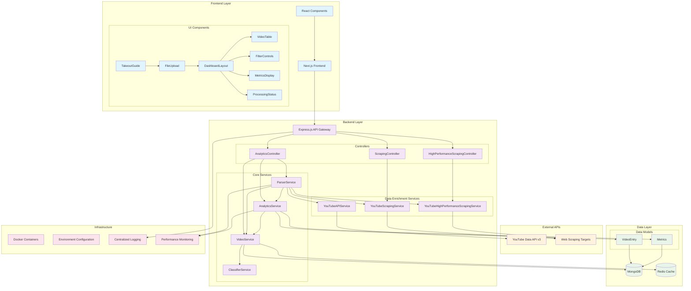
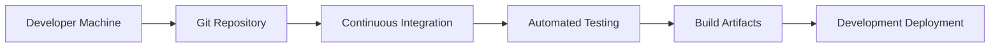
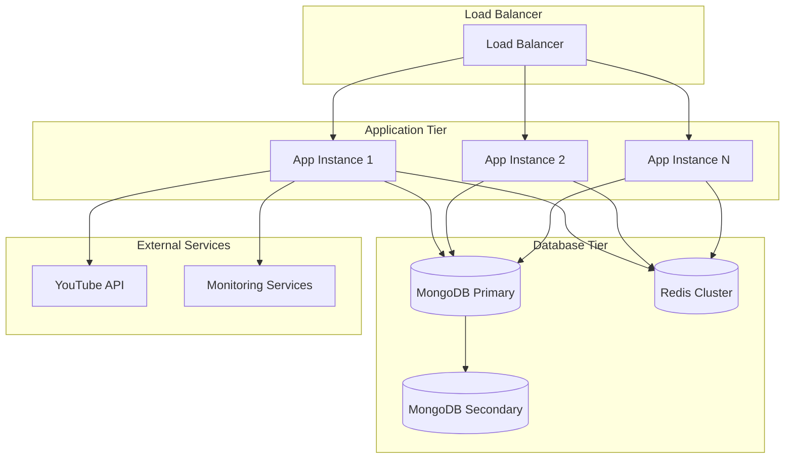

# System Architecture Overview

## Rabbit YouTube Analytics Platform

The Rabbit YouTube Analytics Platform is a comprehensive business intelligence solution that transforms YouTube watch history data into actionable insights through advanced analytics, data enrichment, and visualization capabilities.

## High-Level Architecture

## Technology Stack

### Frontend Technologies
- **Framework**: Next.js 14 with App Router
- **Styling**: Tailwind CSS with custom components
- **Charts**: Recharts for interactive data visualization
- **State Management**: React hooks with context
- **File Handling**: Advanced drag-and-drop upload with validation
- **UI Components**: Custom component library with accessibility support

### Backend Technologies
- **Runtime**: Node.js 18+ with TypeScript
- **Framework**: Express.js with comprehensive middleware stack
- **Database**: MongoDB with Mongoose ODM
- **Caching**: Redis for performance optimization
- **APIs**: YouTube Data API v3 integration
- **Processing**: Advanced HTML parsing and data enrichment
- **Testing**: Jest for unit and integration testing

### Infrastructure & DevOps
- **Containerization**: Docker with multi-stage builds
- **Development**: Hot reload and debugging tools
- **Monitoring**: Comprehensive logging and error tracking
- **Security**: Rate limiting, CORS, and input validation
- **Performance**: Caching strategies and query optimization

## Core Design Principles

### 1. Modular Architecture
- **Service-Oriented Design**: Each service handles a specific domain responsibility
- **Loose Coupling**: Services communicate through well-defined interfaces
- **High Cohesion**: Related functionality is grouped together
- **Dependency Injection**: Services are injected rather than hard-coded

### 2. Data-Driven Processing
- **ETL Pipeline**: Extract, Transform, Load pattern for data processing
- **Enrichment Strategy**: Multiple data sources for comprehensive insights
- **Caching Layer**: Redis caching for frequently accessed data
- **Performance Optimization**: Batch processing and concurrent operations

### 3. Scalability & Performance
- **Horizontal Scaling**: Services designed for multi-instance deployment
- **Resource Management**: Connection pooling and resource optimization
- **Rate Limiting**: API quota management and throttling
- **Monitoring**: Performance metrics and health checks

### 4. User Experience Focus
- **Progressive Enhancement**: Core functionality works without JavaScript
- **Real-time Feedback**: Live progress updates during processing
- **Responsive Design**: Mobile-first responsive UI
- **Accessibility**: WCAG 2.1 compliance and keyboard navigation

## Security Considerations

### 1. Data Protection
- **Input Validation**: Comprehensive validation using Zod schemas
- **Sanitization**: HTML and data sanitization to prevent XSS
- **Rate Limiting**: Protection against abuse and DoS attacks
- **CORS Configuration**: Secure cross-origin resource sharing

### 2. API Security
- **Authentication**: Token-based authentication (when implemented)
- **Authorization**: Role-based access control
- **Quota Management**: YouTube API quota monitoring and optimization
- **Error Handling**: Secure error messages without information leakage

### 3. Infrastructure Security
- **Environment Variables**: Secure configuration management
- **Container Security**: Minimal attack surface in Docker images
- **Network Security**: Secure communication between services
- **Logging**: Security event logging and monitoring

## Performance Characteristics

### 1. Processing Performance
- **File Upload**: Supports files up to 50MB
- **Parsing Speed**: ~1000 entries per second
- **Enrichment Rate**: 100 API calls per day (quota dependent)
- **Database Operations**: Optimized bulk operations

### 2. Scalability Metrics
- **Concurrent Users**: Designed for 100+ concurrent sessions
- **Data Volume**: Handles watch histories with 100k+ entries
- **Memory Usage**: ~512MB base memory footprint
- **Storage**: Efficient document storage with indexing

### 3. Availability Targets
- **Uptime**: 99.9% availability target
- **Response Time**: <200ms for API endpoints
- **Recovery Time**: <5 minutes for service restart
- **Data Durability**: 99.999% with MongoDB replication

## Deployment Architecture

### Development Environment

### Production Environment

## Quality Assurance

### Testing Strategy
- **Unit Tests**: Service-level testing with Jest
- **Integration Tests**: API endpoint testing
- **End-to-End Tests**: Full workflow testing with Playwright
- **Performance Tests**: Load testing and benchmarking
- **Security Tests**: Vulnerability scanning and penetration testing

### Code Quality
- **TypeScript**: Strong typing for better code quality
- **ESLint**: Code style and quality enforcement
- **Prettier**: Consistent code formatting
- **Husky**: Pre-commit hooks for quality gates
- **SonarQube**: Continuous code quality monitoring

This architecture provides a solid foundation for the Rabbit YouTube Analytics Platform, enabling scalable data processing, comprehensive analytics, and exceptional user experience while maintaining high performance and security standards.