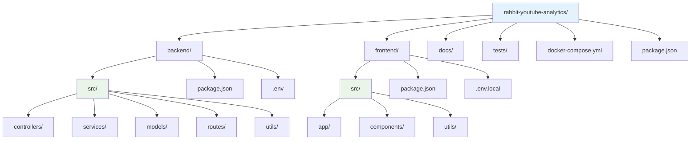
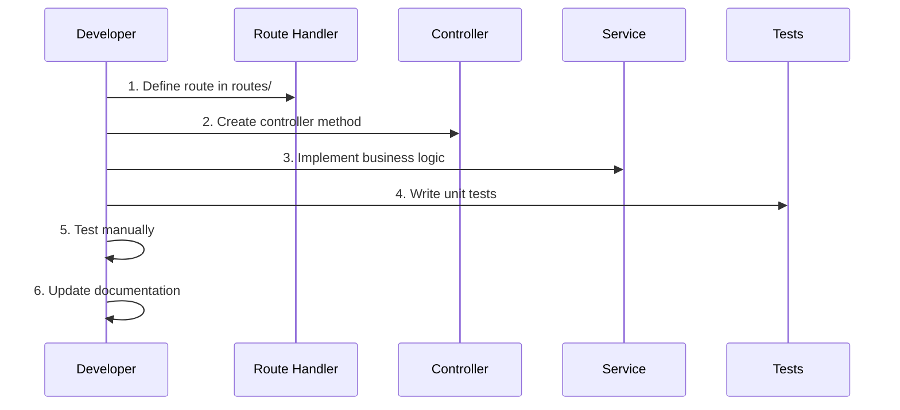
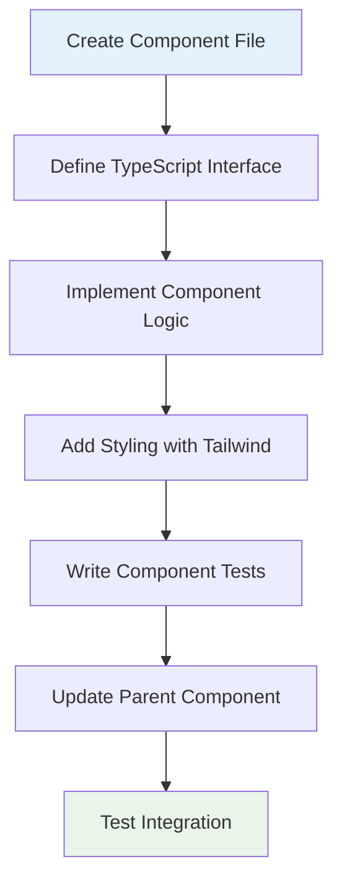
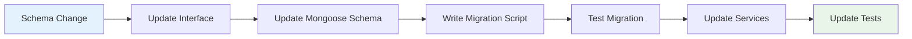
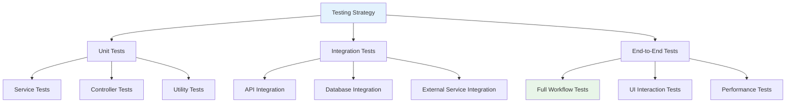

# Getting Started - Developer Guide

## Overview

This guide will help you set up a complete development environment for the Rabbit YouTube Analytics Platform. Follow these steps to get the platform running locally and start contributing to the project.

## Prerequisites

### System Requirements

```mermaid
graph LR
    A[Development Machine] --> B[Node.js 18+]
    A --> C[Docker & Docker Compose]
    A --> D[Git]
    A --> E[MongoDB]
    A --> F[Redis (Optional)]
    A --> G[YouTube API Key]
    
    subgraph "IDE & Tools"
        H[VS Code (Recommended)]
        I[Postman/Thunder Client]
        J[MongoDB Compass]
        K[Redis CLI]
    end
    
    A --> H
    A --> I
    A --> J
    A --> K
    
    style A fill:#e3f2fd
    style G fill:#fff3e0
```

### Required Software Versions

- **Node.js**: Version 18.0.0 or higher
- **npm**: Version 9.0.0 or higher
- **Docker**: Version 20.0.0 or higher
- **Docker Compose**: Version 2.0.0 or higher
- **Git**: Version 2.30.0 or higher

### External Services

1. **MongoDB**: Local installation or MongoDB Atlas
2. **Redis**: Local installation or Redis Cloud (optional, for caching)
3. **YouTube Data API v3**: Google Cloud Console API key

## Quick Start

### 1. Repository Setup

```bash
# Clone the repository
git clone https://github.com/your-org/rabbit-youtube-analytics.git
cd rabbit-youtube-analytics

# Check Node.js version
node --version  # Should be 18.0.0+
npm --version   # Should be 9.0.0+
```

### 2. Environment Configuration

```bash
# Copy environment templates
cp backend/.env.example backend/.env
cp frontend/.env.example frontend/.env.local

# Install dependencies for both services
npm run install:all
```

### 3. Database Setup

#### Option A: Docker Compose (Recommended)

```bash
# Start MongoDB and Redis using Docker
docker-compose up -d mongodb redis

# Verify services are running
docker-compose ps
```

#### Option B: Local Installation

```bash
# MongoDB (Ubuntu/Debian)
sudo apt-get install mongodb
sudo systemctl start mongod
sudo systemctl enable mongod

# Redis (Ubuntu/Debian)
sudo apt-get install redis-server
sudo systemctl start redis
sudo systemctl enable redis

# macOS (using Homebrew)
brew install mongodb/brew/mongodb-community
brew install redis
brew services start mongodb-community
brew services start redis
```

### 4. API Key Configuration

```bash
# Edit backend/.env
nano backend/.env
```

Add your YouTube Data API v3 key:

```env
# YouTube API Configuration
YOUTUBE_API_KEY=your_youtube_api_key_here
YOUTUBE_API_QUOTA_LIMIT=10000
YOUTUBE_API_REQUESTS_PER_100_SECONDS=100

# Database Configuration
MONGODB_URI=mongodb://localhost:27017/rabbit-analytics
MONGODB_DB_NAME=rabbit-analytics

# Redis Configuration (Optional)
REDIS_URL=redis://localhost:6379
REDIS_ENABLED=true

# Server Configuration
PORT=5000
NODE_ENV=development
CORS_ORIGIN=http://localhost:3000,http://localhost:3001

# File Upload Configuration
MAX_FILE_SIZE=50mb
UPLOAD_TIMEOUT=300000

# Rate Limiting
RATE_LIMIT_WINDOW_MS=900000
RATE_LIMIT_MAX_REQUESTS=100

# Logging
LOG_LEVEL=debug
LOG_FORMAT=development

# Web Scraping Configuration
SCRAPING_ENABLED=true
SCRAPING_CONCURRENT_REQUESTS=3
SCRAPING_DELAY_MS=2000
SCRAPING_TIMEOUT_MS=30000
SCRAPING_RETRY_ATTEMPTS=3

# High Performance Scraping
HP_SCRAPING_ENABLED=true
HP_SCRAPING_BROWSER_POOL_SIZE=3
HP_SCRAPING_CONCURRENT_BATCHES=2
```

### 5. Frontend Configuration

```bash
# Edit frontend/.env.local
nano frontend/.env.local
```

```env
# API Configuration
NEXT_PUBLIC_API_URL=http://localhost:5000/api
NEXT_PUBLIC_APP_NAME=Rabbit YouTube Analytics

# Development Settings
NEXT_PUBLIC_DEBUG_MODE=true
NEXT_PUBLIC_LOG_LEVEL=debug

# Feature Flags
NEXT_PUBLIC_ENABLE_SCRAPING=true
NEXT_PUBLIC_ENABLE_HIGH_PERFORMANCE=true
NEXT_PUBLIC_ENABLE_ANALYTICS_EXPORT=true
```

### 6. Start Development Servers

```bash
# Option A: Start all services with one command
npm run dev

# Option B: Start services individually
# Terminal 1: Backend
cd backend && npm run dev

# Terminal 2: Frontend
cd frontend && npm run dev

# Terminal 3: Database (if using Docker)
docker-compose up mongodb redis
```

## Development Workflow

### Project Structure Overview



### Development Scripts

```json
{
  "scripts": {
    "dev": "concurrently \"npm run dev:backend\" \"npm run dev:frontend\"",
    "dev:backend": "cd backend && npm run dev",
    "dev:frontend": "cd frontend && npm run dev",
    "build": "npm run build:backend && npm run build:frontend",
    "build:backend": "cd backend && npm run build",
    "build:frontend": "cd frontend && npm run build",
    "test": "npm run test:backend && npm run test:frontend",
    "test:backend": "cd backend && npm test",
    "test:frontend": "cd frontend && npm test",
    "install:all": "npm install && cd backend && npm install && cd ../frontend && npm install",
    "clean": "npm run clean:backend && npm run clean:frontend",
    "clean:backend": "cd backend && rm -rf node_modules dist",
    "clean:frontend": "cd frontend && rm -rf node_modules .next",
    "docker:up": "docker-compose up -d",
    "docker:down": "docker-compose down",
    "docker:logs": "docker-compose logs -f"
  }
}
```

### File Structure Deep Dive

#### Backend Structure

```
backend/
├── src/
│   ├── controllers/          # API endpoint handlers
│   │   ├── AnalyticsController.ts
│   │   ├── ScrapingController.ts
│   │   └── HighPerformanceScrapingController.ts
│   ├── services/            # Business logic layer
│   │   ├── AnalyticsService.ts
│   │   ├── ParserService.ts
│   │   ├── VideoService.ts
│   │   ├── YouTubeAPIService.ts
│   │   ├── YouTubeScrapingService.ts
│   │   ├── YouTubeHighPerformanceScrapingService.ts
│   │   └── ClassifierService.ts
│   ├── models/              # Data models and schemas
│   │   ├── VideoEntry.ts
│   │   └── Metrics.ts
│   ├── routes/              # Express route definitions
│   │   ├── analyticsRoutes.ts
│   │   ├── scrapingRoutes.ts
│   │   └── highPerformanceScrapingRoutes.ts
│   ├── utils/               # Utility functions
│   │   ├── database.ts
│   │   ├── logger.ts
│   │   └── validation.ts
│   ├── workers/             # Background workers
│   └── index.ts             # Application entry point
├── tests/                   # Test files
├── package.json
├── tsconfig.json
└── .env
```

#### Frontend Structure

```
frontend/
├── src/
│   ├── app/                 # Next.js App Router
│   │   ├── page.tsx         # Main dashboard page
│   │   ├── layout.tsx       # Root layout
│   │   └── globals.css      # Global styles
│   ├── components/          # React components
│   │   ├── DashboardLayout.tsx
│   │   ├── TakeoutGuide.tsx
│   │   ├── FileUpload.tsx
│   │   ├── VideoTable.tsx
│   │   ├── FilterControls.tsx
│   │   ├── MetricsDisplay.tsx
│   │   ├── ProcessingStatus.tsx
│   │   └── ErrorBoundary.tsx
│   └── utils/               # Frontend utilities
│       ├── api.ts
│       ├── types.ts
│       └── helpers.ts
├── public/                  # Static assets
├── tests/                   # Test files
├── package.json
├── next.config.js
├── tailwind.config.js
└── .env.local
```

## Development Tasks

### 1. Adding a New API Endpoint



#### Step-by-Step Process

1. **Define the Route**

```typescript
// backend/src/routes/analyticsRoutes.ts
router.get('/new-endpoint', analyticsController.newMethod.bind(analyticsController));
```

2. **Create Controller Method**

```typescript
// backend/src/controllers/AnalyticsController.ts
public async newMethod(req: Request, res: Response): Promise<Response> {
  try {
    const services = this.getServices(req);
    const result = await services.analytics.newServiceMethod();
    
    return res.status(200).json({
      success: true,
      data: result,
      timestamp: new Date().toISOString()
    });
  } catch (error) {
    logger.error('New method failed', { error });
    return res.status(500).json({
      error: 'Operation failed',
      message: error instanceof Error ? error.message : 'Unknown error',
      timestamp: new Date().toISOString()
    });
  }
}
```

3. **Implement Service Logic**

```typescript
// backend/src/services/AnalyticsService.ts
public async newServiceMethod(): Promise<any> {
  // Implement business logic here
  return { message: 'New service method implemented' };
}
```

4. **Add Tests**

```typescript
// backend/tests/controllers/AnalyticsController.test.ts
describe('AnalyticsController.newMethod', () => {
  it('should return success response', async () => {
    const response = await request(app)
      .get('/api/analytics/new-endpoint')
      .expect(200);
      
    expect(response.body.success).toBe(true);
    expect(response.body.data).toBeDefined();
  });
});
```

### 2. Adding a New Frontend Component



#### Component Template

```typescript
// frontend/src/components/NewComponent.tsx
import React, { useState, useEffect } from 'react';

interface NewComponentProps {
  data?: any[];
  onAction?: (item: any) => void;
  loading?: boolean;
}

export default function NewComponent({ 
  data = [], 
  onAction, 
  loading = false 
}: NewComponentProps) {
  const [localState, setLocalState] = useState<any>(null);
  
  useEffect(() => {
    // Component initialization logic
  }, [data]);
  
  const handleClick = (item: any) => {
    if (onAction) {
      onAction(item);
    }
  };
  
  if (loading) {
    return (
      <div className="flex items-center justify-center p-8">
        <div className="animate-spin rounded-full h-8 w-8 border-b-2 border-blue-600"></div>
      </div>
    );
  }
  
  return (
    <div className="bg-white rounded-lg shadow-md p-6">
      <h3 className="text-lg font-semibold mb-4">New Component</h3>
      {data.map((item, index) => (
        <div key={index} className="border-b border-gray-200 py-2">
          <button
            onClick={() => handleClick(item)}
            className="text-blue-600 hover:text-blue-800 transition-colors"
          >
            {item.name}
          </button>
        </div>
      ))}
    </div>
  );
}
```

### 3. Database Schema Changes

When modifying database schemas:

```typescript
// backend/src/models/VideoEntry.ts
export interface IVideoEntry {
  // Existing fields...
  newField?: string; // Add new optional field
  
  // Or update existing field
  existingField: string; // Remove optional modifier
}

// Update the Mongoose schema
const videoEntrySchema = new Schema<IVideoEntry>({
  // Existing schema...
  newField: {
    type: String,
    required: false,
    default: null
  },
  existingField: {
    type: String,
    required: true // Update requirement
  }
});
```

#### Migration Strategy



## Testing Strategy

### Test Structure



### Running Tests

```bash
# Run all tests
npm test

# Run backend tests only
npm run test:backend

# Run frontend tests only
npm run test:frontend

# Run tests in watch mode
npm run test:watch

# Run tests with coverage
npm run test:coverage

# Run specific test file
npm test -- --testNamePattern="AnalyticsService"

# Run tests for specific functionality
npm test -- --grep="video parsing"
```

### Test Example

```typescript
// backend/tests/services/AnalyticsService.test.ts
import { AnalyticsService } from '../../src/services/AnalyticsService';
import { VideoEntry } from '../../src/models/VideoEntry';

describe('AnalyticsService', () => {
  let analyticsService: AnalyticsService;
  let mockVideoEntries: VideoEntry[];
  
  beforeEach(() => {
    analyticsService = new AnalyticsService();
    mockVideoEntries = createMockVideoEntries(100);
  });
  
  describe('generateMetrics', () => {
    it('should calculate correct overview metrics', async () => {
      const metrics = await analyticsService.generateMetrics(mockVideoEntries);
      
      expect(metrics.overview.totalVideos).toBe(100);
      expect(metrics.overview.totalWatchTime).toBeGreaterThan(0);
      expect(metrics.overview.uniqueChannels).toBeGreaterThan(0);
    });
    
    it('should handle empty input gracefully', async () => {
      const metrics = await analyticsService.generateMetrics([]);
      
      expect(metrics.overview.totalVideos).toBe(0);
      expect(metrics.overview.totalWatchTime).toBe(0);
    });
  });
});
```

## Debugging and Troubleshooting

### Common Issues

#### 1. Database Connection Issues

```bash
# Check MongoDB status
mongosh --eval "db.runCommand('ping')"

# Check MongoDB logs
tail -f /var/log/mongodb/mongod.log

# Restart MongoDB service
sudo systemctl restart mongod
```

#### 2. API Key Issues

```bash
# Test YouTube API key
curl "https://www.googleapis.com/youtube/v3/videos?id=dQw4w9WgXcQ&key=YOUR_API_KEY&part=snippet"
```

#### 3. Port Conflicts

```bash
# Check what's running on port 5000
lsof -i :5000

# Check what's running on port 3000
lsof -i :3000

# Kill process if needed
kill -9 <PID>
```

### Debug Configuration

```typescript
// backend/src/utils/logger.ts
export const logger = winston.createLogger({
  level: process.env.LOG_LEVEL || 'info',
  format: winston.format.combine(
    winston.format.timestamp(),
    winston.format.errors({ stack: true }),
    winston.format.json()
  ),
  transports: [
    new winston.transports.Console({
      format: winston.format.combine(
        winston.format.colorize(),
        winston.format.simple()
      )
    }),
    new winston.transports.File({ 
      filename: 'logs/error.log', 
      level: 'error' 
    }),
    new winston.transports.File({ 
      filename: 'logs/combined.log' 
    })
  ]
});
```

### Performance Monitoring

```typescript
// Add performance monitoring to any service
import { createTimer } from '../utils/logger';

public async someMethod() {
  const timer = createTimer('SomeMethod Execution');
  
  try {
    // Method implementation
    const result = await this.doSomething();
    
    timer.end({ success: true, resultCount: result.length });
    return result;
  } catch (error) {
    timer.end({ success: false, error: error.message });
    throw error;
  }
}
```

## Next Steps

Once you have the development environment set up:

1. **Explore the Codebase**: Read through the service documentation in `docs/services/`
2. **Run Sample Tests**: Execute the test suite to understand the testing patterns
3. **Make a Small Change**: Try adding a simple feature or fixing a minor issue
4. **Review Code Style**: Follow the existing patterns and conventions
5. **Check Performance**: Use the monitoring tools to understand system behavior

For more detailed information, see:
- [Testing Strategy](./testing-strategy.md)
- [Performance Optimization](./performance-optimization.md)
- [Service Documentation](../services/)
- [API Design](../architecture/api-design.md)

This development environment provides a solid foundation for contributing to the Rabbit YouTube Analytics Platform with comprehensive tooling, testing, and debugging capabilities.