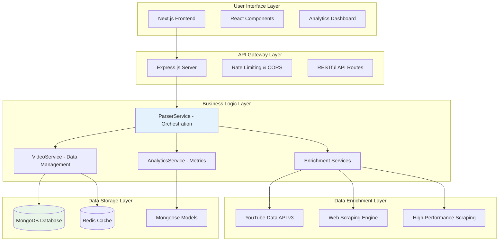
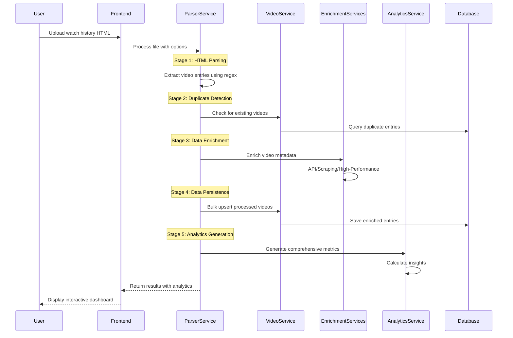
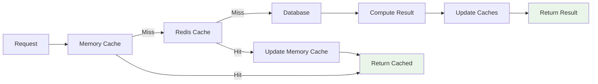
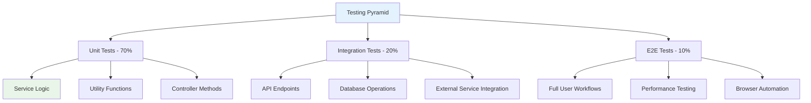

# Codebase Summary - LLM Context

## Executive Summary

The Rabbit YouTube Analytics Platform is a comprehensive TypeScript-based web application that transforms YouTube watch history data into actionable business intelligence. Built with modern web technologies, it features a robust ETL pipeline, multiple data enrichment strategies, and advanced analytics capabilities.

## Platform Architecture

### High-Level System Design



### Technology Stack

**Backend Stack:**
- **Runtime**: Node.js 18+ with TypeScript
- **Framework**: Express.js with comprehensive middleware
- **Database**: MongoDB with Mongoose ODM
- **Caching**: Redis for performance optimization
- **External APIs**: YouTube Data API v3, Web scraping with Playwright
- **Testing**: Jest for unit and integration testing

**Frontend Stack:**
- **Framework**: Next.js 14 with App Router
- **Language**: TypeScript with strict type checking
- **Styling**: Tailwind CSS with custom components
- **Charts**: Recharts for data visualization
- **State**: React hooks and context for state management

## Core Data Flow

### Primary Processing Pipeline



## Key Services Architecture

### 1. ParserService (Orchestration Engine)

**Purpose**: Coordinates the entire data processing pipeline from HTML parsing to analytics generation.

**Key Responsibilities:**
- HTML parsing using regex patterns
- Progress tracking with real-time updates
- Service orchestration and error handling
- Session management for concurrent processing

**Critical Methods:**
- `parseWatchHistory()` - Main orchestration method
- `extractWatchHistoryEntries()` - HTML parsing logic
- `enrichVideoEntries()` - Coordinates enrichment strategies
- `updateProgress()` - Real-time progress tracking

### 2. AnalyticsService (Intelligence Engine)

**Purpose**: Transforms raw video data into comprehensive analytics and insights.

**Key Capabilities:**
- Overview metrics calculation
- Category and channel analysis
- Temporal pattern detection
- Trend analysis with statistical modeling
- Discovery pattern insights

**Mathematical Algorithms:**
- Statistical analysis for peak detection
- Linear regression for trend analysis
- Time-series aggregation and decomposition
- Compound growth rate calculations

### 3. VideoService (Data Management)

**Purpose**: Handles all database operations and data persistence logic.

**Core Functions:**
- Duplicate detection and deduplication
- Bulk upsert operations for performance
- Query optimization with indexing
- Content classification integration

### 4. Enrichment Services (Data Enhancement)

**Three-Strategy Approach:**

1. **YouTubeAPIService**: Official API with quota management
2. **YouTubeScrapingService**: 4-strategy web scraping fallback
3. **YouTubeHighPerformanceScrapingService**: Parallel browser automation

**Common Interface**: All services implement the same `VideoMetadata` interface for seamless switching.

## Data Models

### Core Data Structures

**VideoEntry Model:**
```typescript
interface IVideoEntry {
  // Core identifiers
  title: string;
  channel: string;
  videoId?: string;
  url: string;
  watchedAt: Date;
  
  // Enriched metadata
  description?: string;
  duration?: number;
  viewCount?: number;
  category: VideoCategory;
  contentType: ContentType;
  
  // Processing metadata
  enrichedWithAPI: boolean;
  enrichmentTimestamp?: Date;
}
```

**Analytics Metrics:**
```typescript
interface VideoMetrics {
  overview: OverviewMetrics;
  categories: CategoryMetrics[];
  channels: ChannelMetrics[];
  temporal: TemporalMetrics;
  discovery: DiscoveryMetrics;
  trends: TrendMetrics;
}
```

## API Design Patterns

### RESTful Endpoint Structure

```
/api/analytics/
├── POST /upload           # File processing initiation
├── GET /progress/:id      # Real-time progress tracking
├── GET /metrics/:id       # Analytics results retrieval
├── GET /entries           # Video entry querying
└── GET /export           # Data export functionality

/api/scraping/
├── GET /stats            # Service statistics
├── GET /test/:videoId    # Single video testing
└── DELETE /cache         # Cache management

/api/high-performance/
├── POST /demo            # Batch processing demo
├── GET /stats            # Performance metrics
└── GET /health           # Service health check
```

### Request/Response Patterns

**Consistent Response Structure:**
```typescript
interface ApiResponse<T> {
  success: boolean;
  data?: T;
  error?: string;
  message?: string;
  timestamp: string;
  requestId?: string;
}
```

**Error Handling Strategy:**
- Graceful degradation with partial results
- Comprehensive error logging
- Circuit breaker patterns for external services
- Retry mechanisms with exponential backoff

## Performance Optimization Strategies

### 1. Caching Architecture



### 2. Batch Processing

- **Video Enrichment**: Process in batches of 20-50 videos
- **Database Operations**: Bulk upsert for efficiency
- **Progress Tracking**: Incremental updates during batch processing

### 3. Concurrent Processing

- **Parser Service**: Multiple concurrent sessions
- **Enrichment Services**: Parallel API/scraping requests
- **Analytics**: Concurrent metric calculations

### 4. Memory Management

- **Streaming Processing**: For large HTML files (>50MB)
- **Garbage Collection**: Explicit hints for large datasets
- **Resource Cleanup**: Proper cleanup of browser instances and connections

## Security Implementation

### 1. Input Validation

- **Zod Schemas**: Comprehensive request validation
- **File Upload**: Size limits and content validation
- **HTML Sanitization**: XSS prevention in parsed content

### 2. Rate Limiting

- **Express Rate Limiter**: 100 requests per 15 minutes per IP
- **YouTube API**: Quota management and rate limiting
- **Scraping Services**: Self-imposed rate limits to prevent blocking

### 3. Error Security

- **Information Leakage**: Sanitized error messages
- **Stack Traces**: Hidden in production environments
- **Logging**: Comprehensive audit trails

## Testing Strategy

### Test Architecture



### Test Coverage Areas

1. **Analytics Accuracy**: Mathematical correctness of calculations
2. **HTML Parsing**: Various HTML structures and edge cases
3. **Error Handling**: Graceful degradation scenarios
4. **Performance**: Load testing and memory usage
5. **Integration**: External API and database interactions

## Deployment Architecture

### Development Environment

- **Local Development**: Docker Compose for services
- **Hot Reload**: Real-time code changes
- **Debug Tools**: Comprehensive logging and monitoring

### Production Considerations

- **Horizontal Scaling**: Stateless service design
- **Load Balancing**: Multiple application instances
- **Database Replication**: MongoDB replica sets
- **Caching Strategy**: Redis clustering
- **Monitoring**: Performance metrics and alerting

## Development Patterns

### 1. Service Pattern

- **Dependency Injection**: Services injected via constructor
- **Interface Segregation**: Clear service contracts
- **Single Responsibility**: Each service has focused purpose

### 2. Error Handling Pattern

- **Graceful Degradation**: Continue processing with partial failures
- **Circuit Breakers**: Prevent cascade failures
- **Retry Logic**: Exponential backoff for transient failures

### 3. Progress Tracking Pattern

- **Real-time Updates**: WebSocket-style progress reporting
- **Session Management**: Concurrent processing sessions
- **Stage-based Progress**: Weighted progress calculation

### 4. Caching Pattern

- **Multi-level Caching**: Memory → Redis → Database
- **Cache Invalidation**: TTL and manual invalidation
- **Cache Warming**: Proactive cache population

## Extension Points

### 1. New Data Sources

- **Service Interface**: Implement common `VideoMetadata` interface
- **Plugin Architecture**: Dynamic service registration
- **Configuration**: Environment-based service selection

### 2. Analytics Modules

- **Metric Calculation**: Add new metric calculation modules
- **Data Export**: New export formats and destinations
- **Visualization**: Additional chart types and dashboards

### 3. Processing Strategies

- **Enrichment Methods**: New data enrichment strategies
- **Parsing Logic**: Support for different HTML structures
- **Classification**: Enhanced content type classification

## Performance Characteristics

### Throughput Metrics

- **HTML Parsing**: ~1000 entries per second
- **Analytics Generation**: ~500 entries per second
- **API Enrichment**: 50 videos per request (quota limited)
- **Scraping Enrichment**: 1-5 videos per second
- **High-Performance Scraping**: 10-50 videos per batch

### Resource Usage

- **Memory**: ~512MB base footprint, scales with data size
- **CPU**: Optimized for multi-core processing
- **Network**: Bandwidth-efficient with compression
- **Storage**: Efficient document storage with indexing

## Code Quality Standards

### TypeScript Usage

- **Strict Mode**: Full type safety enforcement
- **Interface Definitions**: Comprehensive type definitions
- **Generic Types**: Reusable type patterns
- **Error Types**: Typed error handling

### Code Organization

- **Layered Architecture**: Clear separation of concerns
- **Modular Design**: Loosely coupled, highly cohesive modules
- **Configuration Management**: Environment-based configuration
- **Documentation**: Comprehensive inline documentation

This codebase represents a modern, scalable, and maintainable platform for YouTube analytics with robust error handling, comprehensive testing, and optimized performance characteristics suitable for production deployment.