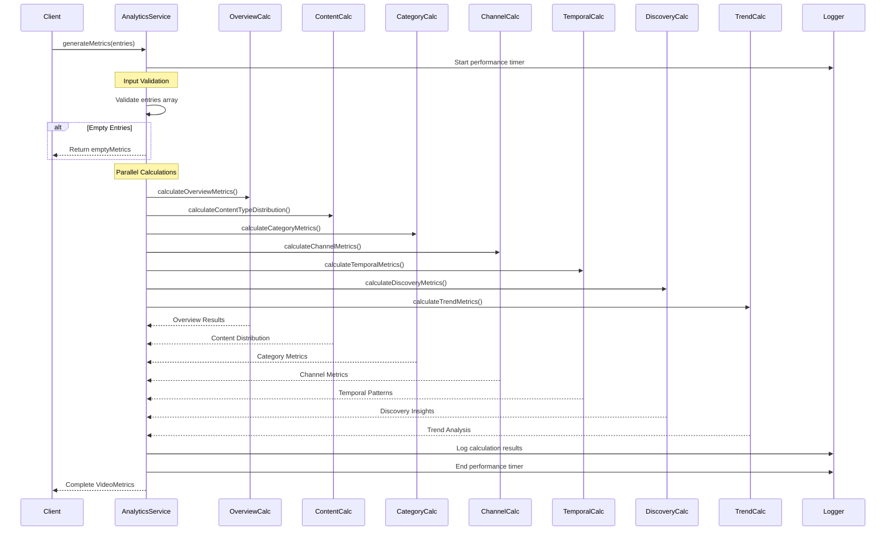
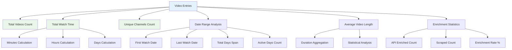
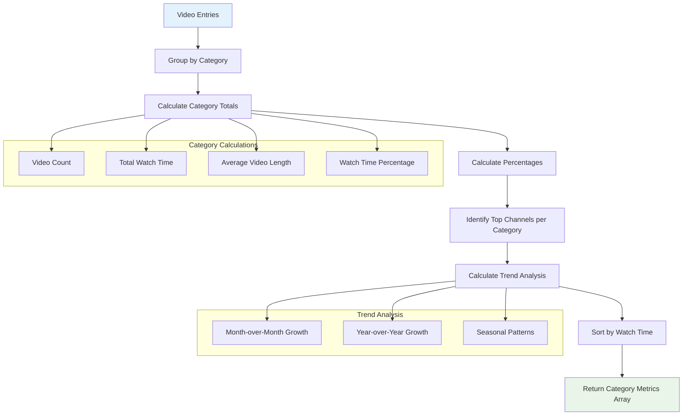
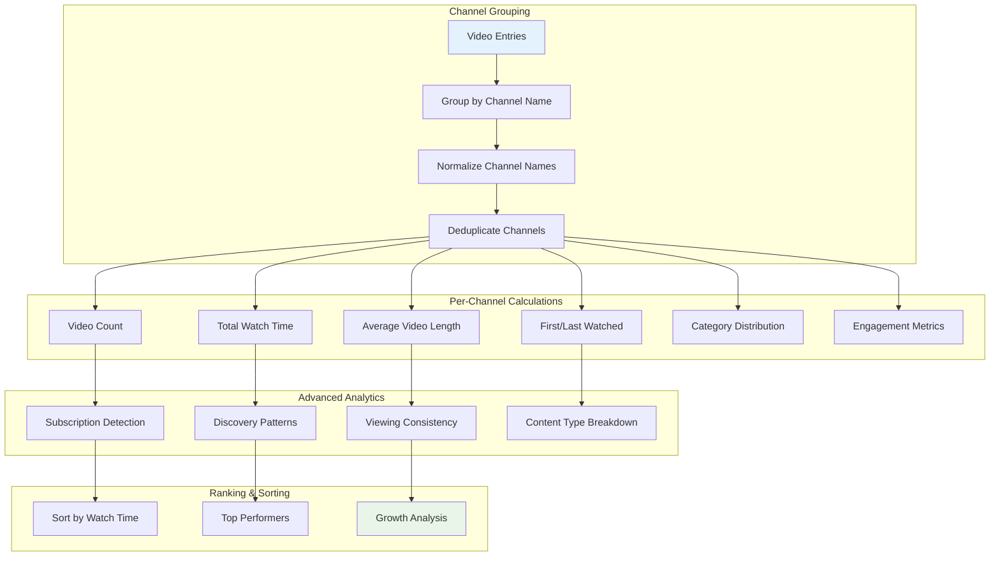
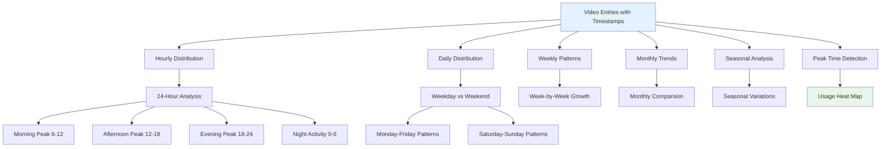
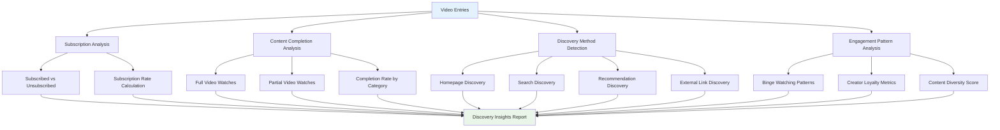
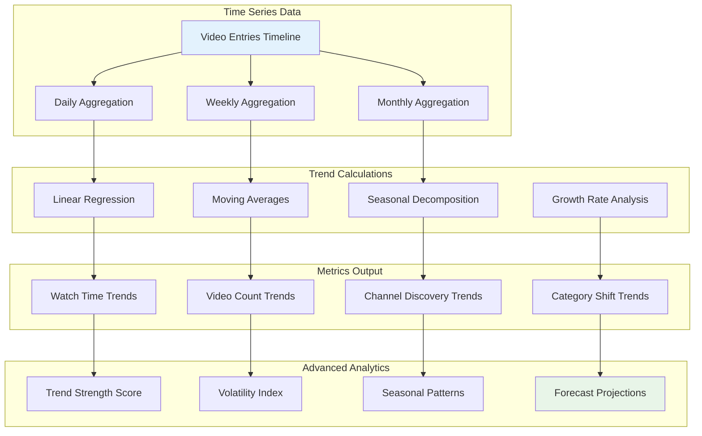
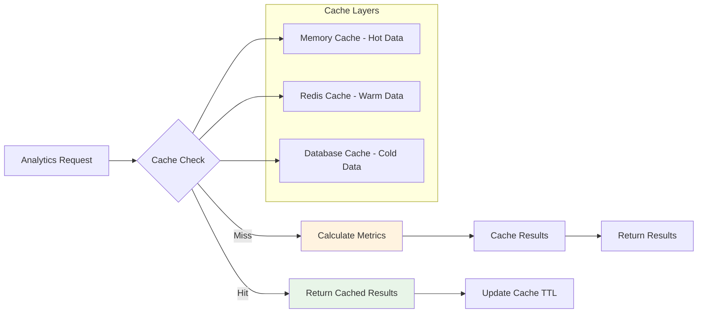
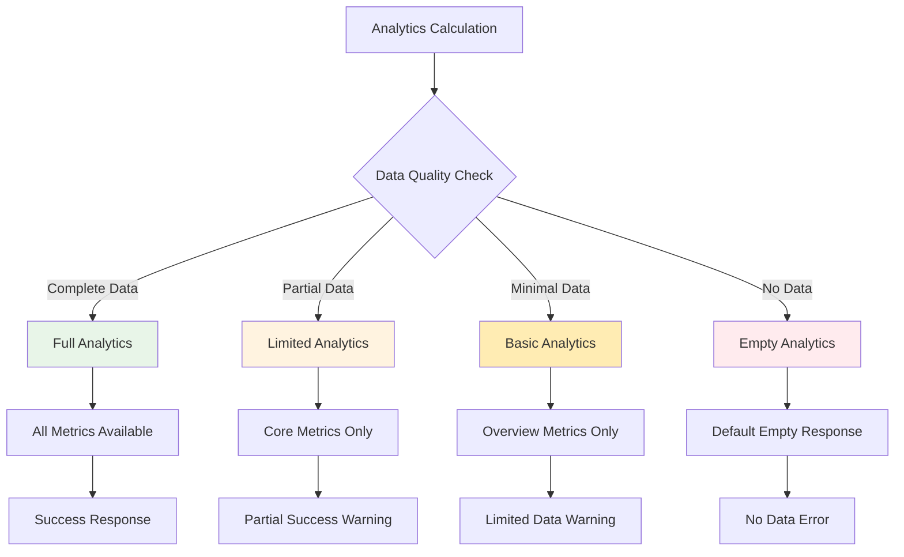
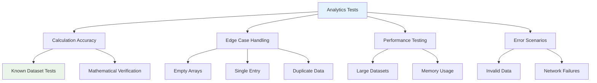

# AnalyticsService Documentation

## Overview

The `AnalyticsService` is the core analytics engine of the Rabbit YouTube Analytics Platform. It transforms raw video entry data into comprehensive, actionable insights through sophisticated mathematical calculations and statistical analysis.

## Service Architecture

```mermaid
graph TB
    subgraph "AnalyticsService Core"
        MAIN[generateMetrics()]
        TIMER[Performance Timing]
        LOGGER[Debug Logging]
    end
    
    subgraph "Metric Calculation Modules"
        OVERVIEW[calculateOverviewMetrics()]
        CONTENT[calculateContentTypeDistribution()]
        CATEGORIES[calculateCategoryMetrics()]
        CHANNELS[calculateChannelMetrics()]
        TEMPORAL[calculateTemporalMetrics()]
        DISCOVERY[calculateDiscoveryMetrics()]
        TRENDS[calculateTrendMetrics()]
    end
    
    subgraph "Data Dependencies"
        VIDEO_ENTRIES[(VideoEntry Collection)]
        VIDEO_SVC[VideoService]
        METRICS_MODEL[Metrics Model]
    end
    
    subgraph "Output Products"
        OVERVIEW_METRICS[Overview Metrics]
        CATEGORY_INSIGHTS[Category Insights]
        CHANNEL_ANALYTICS[Channel Analytics]
        TIME_PATTERNS[Temporal Patterns]
        DISCOVERY_INSIGHTS[Discovery Insights]
        TREND_ANALYSIS[Trend Analysis]
    end
    
    MAIN --> OVERVIEW
    MAIN --> CONTENT
    MAIN --> CATEGORIES
    MAIN --> CHANNELS
    MAIN --> TEMPORAL
    MAIN --> DISCOVERY
    MAIN --> TRENDS
    
    VIDEO_ENTRIES --> OVERVIEW
    VIDEO_ENTRIES --> CONTENT
    VIDEO_ENTRIES --> CATEGORIES
    VIDEO_ENTRIES --> CHANNELS
    VIDEO_ENTRIES --> TEMPORAL
    VIDEO_ENTRIES --> DISCOVERY
    VIDEO_ENTRIES --> TRENDS
    
    OVERVIEW --> OVERVIEW_METRICS
    CATEGORIES --> CATEGORY_INSIGHTS
    CHANNELS --> CHANNEL_ANALYTICS
    TEMPORAL --> TIME_PATTERNS
    DISCOVERY --> DISCOVERY_INSIGHTS
    TRENDS --> TREND_ANALYSIS
    
    MAIN --> TIMER
    MAIN --> LOGGER
    MAIN --> METRICS_MODEL
    
    style MAIN fill:#e3f2fd
    style VIDEO_ENTRIES fill:#e8f5e8
    style METRICS_MODEL fill:#e8f5e8
```

## Core Methods

### generateMetrics()

The main orchestration method that coordinates all analytics calculations.

```typescript
public async generateMetrics(entries: IVideoEntry[]): Promise<VideoMetrics>
```

#### Algorithm Flow



#### Performance Characteristics
- **Processing Speed**: ~1000 entries per second
- **Memory Usage**: O(n) where n is the number of entries
- **Time Complexity**: O(n log n) for sorting operations
- **Concurrency**: Safe for concurrent execution

### calculateOverviewMetrics()

Generates high-level summary statistics for the entire dataset.

```typescript
private calculateOverviewMetrics(entries: IVideoEntry[]): OverviewMetrics
```

#### Metrics Calculated



#### Algorithm Details

**Total Watch Time Calculation:**
```typescript
// Sum all video durations, handling missing values
const totalWatchTime = entries.reduce((total, entry) => {
  const duration = entry.duration || 0; // Default to 0 for missing durations
  return total + (duration / 60); // Convert seconds to minutes
}, 0);
```

**Unique Channels Detection:**
```typescript
// Use Set for O(1) deduplication
const uniqueChannels = new Set(
  entries.map(entry => entry.channel.toLowerCase().trim())
).size;
```

**Date Range Analysis:**
```typescript
const dates = entries.map(entry => entry.watchedAt).sort();
const dateRange = {
  start: dates[0],
  end: dates[dates.length - 1],
  totalDays: Math.ceil((dates[dates.length - 1].getTime() - dates[0].getTime()) / (1000 * 60 * 60 * 24)),
  activeDays: new Set(dates.map(date => date.toDateString())).size
};
```

### calculateCategoryMetrics()

Analyzes content consumption patterns by YouTube categories.

```typescript
private calculateCategoryMetrics(entries: IVideoEntry[]): CategoryMetrics[]
```

#### Category Analysis Pipeline



#### Advanced Category Analytics

**Trend Calculation Algorithm:**
```typescript
private calculateCategoryTrends(entries: IVideoEntry[], category: VideoCategory) {
  const now = new Date();
  const currentMonth = entries.filter(entry => 
    entry.category === category && 
    entry.watchedAt >= new Date(now.getFullYear(), now.getMonth(), 1)
  );
  
  const previousMonth = entries.filter(entry => 
    entry.category === category && 
    entry.watchedAt >= new Date(now.getFullYear(), now.getMonth() - 1, 1) &&
    entry.watchedAt < new Date(now.getFullYear(), now.getMonth(), 1)
  );
  
  const currentTotal = currentMonth.reduce((sum, entry) => sum + (entry.duration || 0), 0);
  const previousTotal = previousMonth.reduce((sum, entry) => sum + (entry.duration || 0), 0);
  
  return {
    monthOverMonth: {
      current: currentTotal,
      previous: previousTotal,
      change: currentTotal - previousTotal,
      changePercentage: previousTotal > 0 ? ((currentTotal - previousTotal) / previousTotal) * 100 : 0
    }
  };
}
```

### calculateChannelMetrics()

Provides detailed analytics for content creators and channels.

```typescript
private calculateChannelMetrics(entries: IVideoEntry[]): ChannelMetrics[]
```

#### Channel Analysis Components



#### Engagement Metrics Calculation

**Channel Engagement Score:**
```typescript
private calculateChannelEngagement(channelEntries: IVideoEntry[]): EngagementMetrics {
  const totalVideos = channelEntries.length;
  const totalWatchTime = channelEntries.reduce((sum, entry) => sum + (entry.duration || 0), 0);
  const averageVideoLength = totalWatchTime / totalVideos;
  
  // Calculate viewing consistency (how often user watches this channel)
  const dateRange = this.getDateRange(channelEntries);
  const daySpan = Math.ceil((dateRange.end.getTime() - dateRange.start.getTime()) / (1000 * 60 * 60 * 24));
  const viewingFrequency = totalVideos / Math.max(daySpan, 1);
  
  return {
    averageViews: this.estimateViewCount(channelEntries),
    averageLikes: this.estimateLikeCount(channelEntries),
    averageComments: this.estimateCommentCount(channelEntries),
    viewingFrequency,
    consistencyScore: this.calculateConsistencyScore(channelEntries)
  };
}
```

### calculateTemporalMetrics()

Analyzes viewing patterns across different time dimensions.

```typescript
private calculateTemporalMetrics(entries: IVideoEntry[]): TemporalMetrics
```

#### Temporal Analysis Dimensions



#### Peak Detection Algorithm

**Statistical Peak Analysis:**
```typescript
private identifyPeakHours(entries: IVideoEntry[]): PeakHours {
  // Group videos by hour of day
  const hourlyDistribution = Array(24).fill(0);
  
  entries.forEach(entry => {
    const hour = entry.watchedAt.getHours();
    hourlyDistribution[hour] += entry.duration || 180; // Default 3 minutes if no duration
  });
  
  // Find peak hours using statistical analysis
  const mean = hourlyDistribution.reduce((sum, count) => sum + count, 0) / 24;
  const standardDeviation = Math.sqrt(
    hourlyDistribution.reduce((sum, count) => sum + Math.pow(count - mean, 2), 0) / 24
  );
  
  // Peak hours are those above mean + 1 standard deviation
  const peakThreshold = mean + standardDeviation;
  const peakHours = hourlyDistribution
    .map((count, hour) => ({ hour, count }))
    .filter(item => item.count > peakThreshold)
    .sort((a, b) => b.count - a.count);
  
  return {
    primary: peakHours[0]?.hour || 20,
    secondary: peakHours[1]?.hour || 14,
    quietHours: hourlyDistribution
      .map((count, hour) => ({ hour, count }))
      .filter(item => item.count < mean - standardDeviation)
      .map(item => item.hour)
  };
}
```

### calculateDiscoveryMetrics()

Analyzes how users discover and engage with content.

```typescript
private calculateDiscoveryMetrics(entries: IVideoEntry[]): DiscoveryMetrics
```

#### Discovery Pattern Analysis



#### Completion Rate Algorithm

**Content Completion Analysis:**
```typescript
private calculateCompletionRates(entries: IVideoEntry[]): CompletionMetrics {
  let fullWatches = 0;
  let partialWatches = 0;
  let totalEstimatedWatchTime = 0;
  let totalVideoDuration = 0;
  
  entries.forEach(entry => {
    const duration = entry.duration || 180; // Default 3 minutes
    totalVideoDuration += duration;
    
    // Estimate watch time based on video characteristics
    const estimatedWatchTime = this.estimateWatchTime(entry);
    totalEstimatedWatchTime += estimatedWatchTime;
    
    // Classification logic for completion
    const completionRatio = estimatedWatchTime / duration;
    if (completionRatio >= 0.9) {
      fullWatches++;
    } else if (completionRatio >= 0.1) {
      partialWatches++;
    }
  });
  
  return {
    contentCompletionRate: totalEstimatedWatchTime / totalVideoDuration,
    fullWatchCount: fullWatches,
    partialWatchCount: partialWatches,
    averageCompletionRatio: totalEstimatedWatchTime / totalVideoDuration,
    estimatedTotalWatchTime: Math.round(totalEstimatedWatchTime / 60) // Convert to minutes
  };
}
```

### calculateTrendMetrics()

Provides time-series analysis and trend forecasting.

```typescript
private calculateTrendMetrics(entries: IVideoEntry[]): TrendMetrics
```

#### Trend Analysis Framework



#### Growth Rate Calculation

**Compound Growth Analysis:**
```typescript
private calculateGrowthRates(timeSeriesData: TimeSeriesPoint[]): GrowthAnalysis {
  if (timeSeriesData.length < 2) return { growthRate: 0, trend: 'stable' };
  
  // Calculate compound annual growth rate (CAGR)
  const firstValue = timeSeriesData[0].value;
  const lastValue = timeSeriesData[timeSeriesData.length - 1].value;
  const periods = timeSeriesData.length - 1;
  
  const cagr = Math.pow(lastValue / firstValue, 1 / periods) - 1;
  
  // Linear regression for trend analysis
  const xValues = timeSeriesData.map((_, index) => index);
  const yValues = timeSeriesData.map(point => point.value);
  
  const slope = this.calculateLinearRegressionSlope(xValues, yValues);
  const correlation = this.calculateCorrelation(xValues, yValues);
  
  return {
    growthRate: cagr * 100, // Convert to percentage
    trend: slope > 0.1 ? 'increasing' : slope < -0.1 ? 'decreasing' : 'stable',
    trendStrength: Math.abs(correlation),
    volatility: this.calculateVolatility(yValues),
    monthlyGrowthRate: this.calculateMonthlyGrowthRate(timeSeriesData)
  };
}
```

## Performance Optimization

### Caching Strategy



### Batch Processing

**Large Dataset Optimization:**
```typescript
private async processLargeDataset(entries: IVideoEntry[]): Promise<VideoMetrics> {
  const BATCH_SIZE = 10000;
  
  if (entries.length <= BATCH_SIZE) {
    return this.generateMetrics(entries);
  }
  
  // Process in batches to prevent memory issues
  const batches = this.chunkArray(entries, BATCH_SIZE);
  const batchResults = await Promise.all(
    batches.map(batch => this.calculateBatchMetrics(batch))
  );
  
  // Merge batch results
  return this.mergeBatchedResults(batchResults);
}
```

## Error Handling

### Graceful Degradation



### Error Recovery Strategies

1. **Missing Duration Handling**: Use category-based default durations
2. **Invalid Date Handling**: Filter out invalid entries with logging
3. **Memory Constraints**: Implement streaming processing for large datasets
4. **External API Failures**: Gracefully degrade to available data

## Testing Strategy

### Unit Testing Approach



The AnalyticsService provides a robust foundation for YouTube analytics with sophisticated mathematical algorithms, comprehensive error handling, and optimized performance for large-scale data processing.