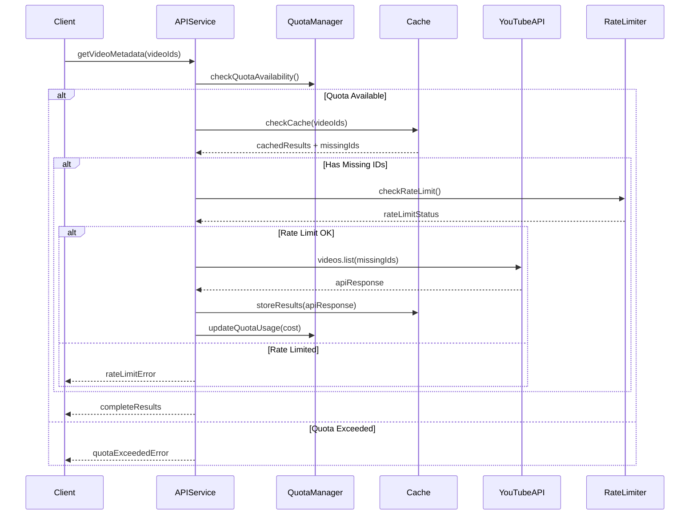
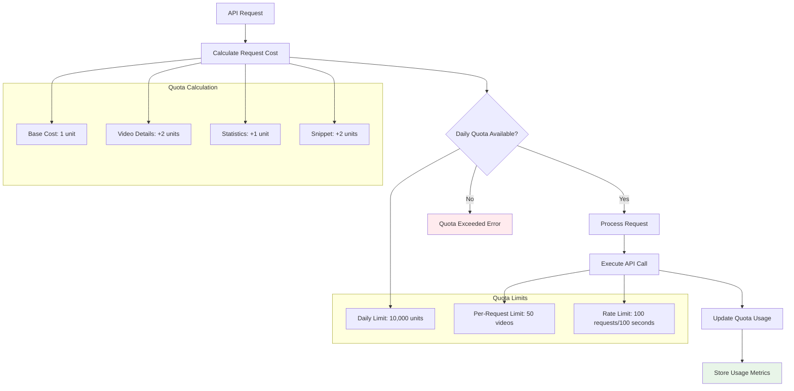
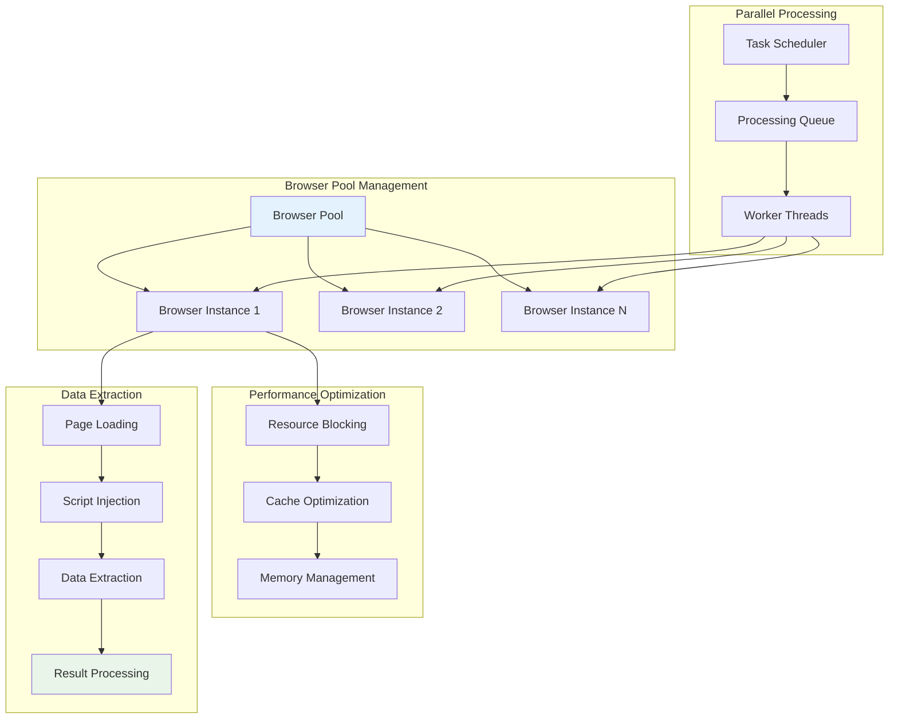
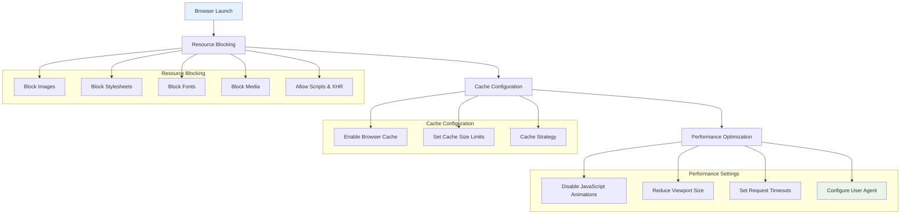
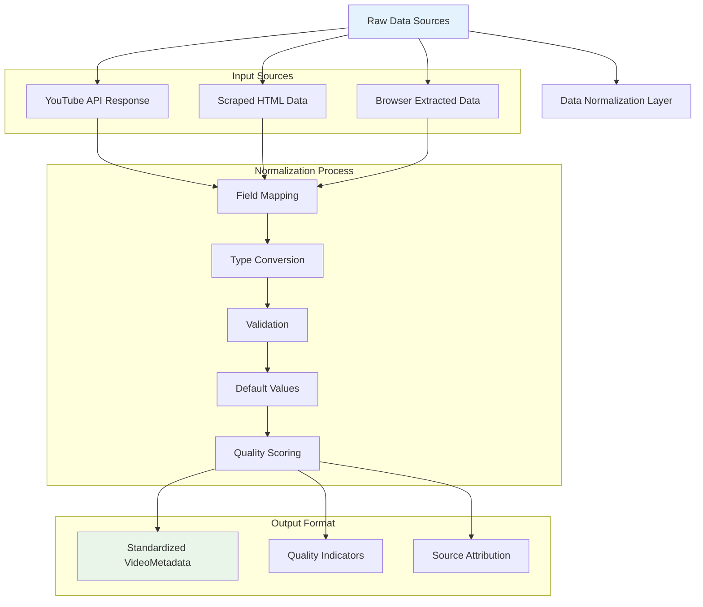

# Enrichment Services Documentation

## Overview

The enrichment services are responsible for gathering comprehensive metadata about YouTube videos from various sources. The platform provides three distinct enrichment strategies: YouTube Data API v3, web scraping, and high-performance parallel scraping, each with specific use cases and capabilities.

## Service Architecture

```mermaid
graph TB
    subgraph "Enrichment Strategy Layer"
        STRATEGY[Enrichment Strategy Selector]
        FALLBACK[Fallback Logic]
        CACHE[Unified Caching Layer]
    end
    
    subgraph "YouTube API Service"
        YT_API_SVC[YouTubeAPIService]
        API_QUOTA[Quota Management]
        API_CACHE[API Response Cache]
        API_BATCH[Batch Processing]
    end
    
    subgraph "YouTube Scraping Service"
        YT_SCRAPING_SVC[YouTubeScrapingService]
        SCRAPING_STRATEGIES[4 Extraction Strategies]
        ANTI_DETECTION[Anti-Detection Measures]
        SCRAPING_CACHE[Scraping Cache]
    end
    
    subgraph "High Performance Service"
        YT_HP_SVC[YouTubeHighPerformanceScrapingService]
        PARALLEL_PROC[Parallel Processing]
        BROWSER_POOL[Browser Pool Management]
        HP_CACHE[High-Performance Cache]
    end
    
    subgraph "External Dependencies"
        YT_API[YouTube Data API v3]
        WEB_TARGETS[YouTube Web Pages]
        BROWSER[Playwright Browsers]
    end
    
    subgraph "Common Interface"
        METADATA_INTERFACE[VideoMetadata Interface]
        ERROR_HANDLING[Unified Error Handling]
        PERFORMANCE_METRICS[Performance Tracking]
    end
    
    STRATEGY --> YT_API_SVC
    STRATEGY --> YT_SCRAPING_SVC
    STRATEGY --> YT_HP_SVC
    
    YT_API_SVC --> YT_API
    YT_SCRAPING_SVC --> WEB_TARGETS
    YT_HP_SVC --> BROWSER
    
    YT_API_SVC --> API_QUOTA
    YT_API_SVC --> API_CACHE
    YT_API_SVC --> API_BATCH
    
    YT_SCRAPING_SVC --> SCRAPING_STRATEGIES
    YT_SCRAPING_SVC --> ANTI_DETECTION
    YT_SCRAPING_SVC --> SCRAPING_CACHE
    
    YT_HP_SVC --> PARALLEL_PROC
    YT_HP_SVC --> BROWSER_POOL
    YT_HP_SVC --> HP_CACHE
    
    YT_API_SVC --> METADATA_INTERFACE
    YT_SCRAPING_SVC --> METADATA_INTERFACE
    YT_HP_SVC --> METADATA_INTERFACE
    
    STRATEGY --> FALLBACK
    FALLBACK --> CACHE
    
    style STRATEGY fill:#e3f2fd
    style METADATA_INTERFACE fill:#e8f5e8
```



## YouTubeAPIService

### Overview

The `YouTubeAPIService` provides the most reliable and comprehensive video metadata by interfacing with the official YouTube Data API v3. It handles quota management, batch processing, and provides the highest quality data.

### Core Implementation

```typescript
class YouTubeAPIService {
  private quotaUsage: Map<string, number>;
  private cache: NodeCache;
  private rateLimiter: RateLimiter;
  
  async getVideoMetadata(videoIds: string[]): Promise<VideoMetadata[]>
  async getChannelInfo(channelId: string): Promise<ChannelMetadata>
  async checkQuotaUsage(): Promise<QuotaStatus>
}
```

### API Request Flow



### Quota Management



### Batch Processing Implementation

```typescript
async processBatchRequest(videoIds: string[]): Promise<VideoMetadata[]> {
  const BATCH_SIZE = 50; // YouTube API limit
  const batches = this.chunkArray(videoIds, BATCH_SIZE);
  const results: VideoMetadata[] = [];
  
  for (const batch of batches) {
    try {
      // Check quota before each batch
      const quotaCheck = await this.checkQuotaUsage();
      if (!quotaCheck.hasAvailableQuota) {
        throw new Error('Daily quota exceeded');
      }
      
      // Execute batch request
      const batchResults = await this.youtube.videos.list({
        part: ['snippet', 'statistics', 'contentDetails'],
        id: batch,
        key: this.apiKey
      });
      
      // Process and normalize results
      const processedResults = this.processAPIResponse(batchResults.data);
      results.push(...processedResults);
      
      // Update quota usage
      await this.updateQuotaUsage(this.calculateRequestCost(batch.length));
      
      // Rate limiting delay
      await this.delay(100);
      
    } catch (error) {
      logger.error(`Batch request failed`, { error, batch });
      // Continue with next batch - don't fail entire operation
    }
  }
  
  return results;
}
```

## YouTubeScrapingService

### Overview

The `YouTubeScrapingService` provides a robust fallback when the YouTube API is unavailable or quota is exceeded. It employs multiple extraction strategies and anti-detection measures to reliably gather video metadata.

### Extraction Strategies

```mermaid
graph TB
    A[Video URL] --> B[Strategy Selection]
    
    B --> C[Strategy 1: JSON-LD]
    B --> D[Strategy 2: ytInitialData]
    B --> E[Strategy 3: Meta Tags]
    B --> F[Strategy 4: DOM Selectors]
    
    subgraph "JSON-LD Strategy"
        C --> G[Extract script[type='application/ld+json']]
        G --> H[Parse VideoObject Schema]
        H --> I[Extract Structured Data]
    end
    
    subgraph "ytInitialData Strategy"
        D --> J[Find ytInitialData JavaScript]
        J --> K[Parse JSON Structure]
        K --> L[Navigate to videoDetails]
    end
    
    subgraph "Meta Tags Strategy"
        E --> M[Open Graph Tags]
        E --> N[Twitter Card Tags]
        E --> O[YouTube Specific Meta]
    end
    
    subgraph "DOM Selectors Strategy"
        F --> P[CSS Selector Fallbacks]
        F --> Q[XPath Expressions]
        F --> R[Text Content Extraction]
    end
    
    I --> S[Validate & Normalize]
    L --> S
    M --> S
    N --> S
    O --> S
    P --> S
    Q --> S
    R --> S
    
    S --> T[Unified VideoMetadata]
    
    style A fill:#e3f2fd
    style T fill:#e8f5e8
```

### Anti-Detection Measures

```mermaid
flowchart TD
    A[Scraping Request] --> B[User-Agent Rotation]
    B --> C[Request Headers Randomization]
    C --> D[IP Rotation (if available)]
    D --> E[Request Timing Variation]
    E --> F[Cache Check]
    
    F --> G{Cache Hit?}
    G -->|Yes| H[Return Cached Data]
    G -->|No| I[Execute Request]
    
    I --> J[Circuit Breaker Check]
    J --> K{Circuit Open?}
    K -->|Yes| L[Return Error]
    K -->|No| M[Make HTTP Request]
    
    M --> N[Response Validation]
    N --> O{Valid Response?}
    O -->|Yes| P[Extract Data]
    O -->|No| Q[Try Next Strategy]
    
    P --> R[Cache Result]
    R --> S[Return Data]
    
    Q --> T{More Strategies?}
    T -->|Yes| U[Next Strategy]
    T -->|No| V[Return Failure]
    
    U --> B
    
    subgraph "Rate Limiting"
        W[Delay Between Requests]
        X[Concurrent Request Limit]
        Y[Backoff on Errors]
    end
    
    I --> W
    I --> X
    M --> Y
    
    style H fill:#e8f5e8
    style S fill:#e8f5e8
    style L fill:#ffebee
    style V fill:#ffebee
```

### Implementation Details

```typescript
class YouTubeScrapingService {
  private extractionStrategies = [
    this.extractFromJSONLD.bind(this),
    this.extractFromYtInitialData.bind(this),
    this.extractFromMetaTags.bind(this),
    this.extractFromDOMSelectors.bind(this)
  ];

  async getVideoMetadata(videoIds: string[]): Promise<VideoMetadata[]> {
    const results: VideoMetadata[] = [];
    
    for (const videoId of videoIds) {
      try {
        const videoUrl = `https://www.youtube.com/watch?v=${videoId}`;
        const metadata = await this.scrapeVideoData(videoUrl);
        
        if (metadata) {
          results.push(metadata);
        }
      } catch (error) {
        logger.warn(`Failed to scrape video ${videoId}`, { error });
      }
    }
    
    return results;
  }

  private async scrapeVideoData(url: string): Promise<VideoMetadata | null> {
    // Check cache first
    const cached = this.cache.get(url);
    if (cached) return cached;
    
    // Circuit breaker check
    if (this.circuitBreaker.isOpen()) {
      throw new Error('Circuit breaker is open');
    }
    
    try {
      // Fetch page content with anti-detection measures
      const response = await this.fetchWithAntiDetection(url);
      const html = response.data;
      
      // Try each extraction strategy in order
      for (const strategy of this.extractionStrategies) {
        try {
          const metadata = await strategy(html, url);
          if (metadata && this.validateMetadata(metadata)) {
            // Cache successful result
            this.cache.set(url, metadata, this.cacheConfig.ttl);
            return metadata;
          }
        } catch (strategyError) {
          logger.debug(`Strategy failed`, { strategy: strategy.name, error: strategyError });
          continue;
        }
      }
      
      return null;
    } catch (error) {
      this.circuitBreaker.recordFailure();
      throw error;
    }
  }
}
```

### JSON-LD Extraction Strategy

```typescript
private extractFromJSONLD(html: string, url: string): VideoMetadata | null {
  try {
    // Find JSON-LD script tags
    const jsonLDPattern = /<script type="application\/ld\+json"[^>]*>(.*?)<\/script>/gs;
    const matches = html.matchAll(jsonLDPattern);
    
    for (const match of matches) {
      try {
        const jsonData = JSON.parse(match[1]);
        
        // Look for VideoObject schema
        if (jsonData['@type'] === 'VideoObject' || 
            (Array.isArray(jsonData) && jsonData.some(item => item['@type'] === 'VideoObject'))) {
          
          const videoObject = Array.isArray(jsonData) 
            ? jsonData.find(item => item['@type'] === 'VideoObject')
            : jsonData;
          
          return this.normalizeJSONLDData(videoObject, url);
        }
      } catch (parseError) {
        continue; // Try next JSON-LD block
      }
    }
    
    return null;
  } catch (error) {
    logger.debug('JSON-LD extraction failed', { error, url });
    return null;
  }
}

private normalizeJSONLDData(videoObject: any, url: string): VideoMetadata {
  return {
    videoId: this.extractVideoId(url),
    title: videoObject.name || '',
    description: videoObject.description || '',
    duration: this.parseDuration(videoObject.duration),
    thumbnailUrl: videoObject.thumbnailUrl?.[0]?.url || videoObject.thumbnailUrl,
    uploadDate: new Date(videoObject.uploadDate),
    viewCount: parseInt(videoObject.interactionStatistic?.userInteractionCount) || 0,
    likeCount: 0, // Not available in JSON-LD
    channel: videoObject.author?.name || '',
    channelId: this.extractChannelId(videoObject.author?.url),
    category: this.mapGenreToCategory(videoObject.genre),
    tags: videoObject.keywords ? videoObject.keywords.split(',').map(k => k.trim()) : [],
    contentType: this.classifyContentType(videoObject),
    extractionMethod: 'json-ld',
    extractionTimestamp: new Date()
  };
}
```

## YouTubeHighPerformanceScrapingService

### Overview

The `YouTubeHighPerformanceScrapingService` leverages browser automation and parallel processing to achieve high-throughput video metadata extraction. It's designed for scenarios requiring rapid processing of large video batches.

### Architecture



### Parallel Processing Implementation

```typescript
class YouTubeHighPerformanceScrapingService {
  private browserPool: Browser[] = [];
  private concurrencyLimit: number;
  private semaphore: Semaphore;

  async getVideoMetadata(videoIds: string[]): Promise<VideoMetadata[]> {
    const results: VideoMetadata[] = [];
    const batches = this.chunkArray(videoIds, this.batchSize);
    
    // Process batches in parallel with concurrency control
    const batchPromises = batches.map(async (batch, index) => {
      await this.semaphore.acquire();
      
      try {
        const batchResults = await this.processBatchParallel(batch, index);
        return batchResults;
      } finally {
        this.semaphore.release();
      }
    });
    
    const batchResults = await Promise.allSettled(batchPromises);
    
    // Aggregate results from all batches
    batchResults.forEach((result, index) => {
      if (result.status === 'fulfilled') {
        results.push(...result.value);
      } else {
        logger.warn(`Batch ${index} failed`, { error: result.reason });
      }
    });
    
    return results;
  }

  private async processBatchParallel(videoIds: string[], batchIndex: number): Promise<VideoMetadata[]> {
    const browser = await this.acquireBrowser();
    const results: VideoMetadata[] = [];
    
    try {
      // Create multiple pages for parallel processing within batch
      const pagePromises = videoIds.map(async (videoId, pageIndex) => {
        const page = await browser.newPage();
        
        try {
          // Configure page for performance
          await this.configurePage(page);
          
          // Extract video metadata
          const metadata = await this.extractVideoMetadata(page, videoId);
          return metadata;
          
        } finally {
          await page.close();
        }
      });
      
      const pageResults = await Promise.allSettled(pagePromises);
      
      pageResults.forEach((result, index) => {
        if (result.status === 'fulfilled' && result.value) {
          results.push(result.value);
        } else {
          logger.debug(`Page extraction failed for video ${videoIds[index]}`, { 
            error: result.status === 'rejected' ? result.reason : 'No data' 
          });
        }
      });
      
    } finally {
      this.releaseBrowser(browser);
    }
    
    return results;
  }
}
```

### Browser Optimization



### Page Configuration Implementation

```typescript
private async configurePage(page: Page): Promise<void> {
  // Block unnecessary resources to improve performance
  await page.route('**/*', (route) => {
    const resourceType = route.request().resourceType();
    const url = route.request().url();
    
    // Block images, stylesheets, fonts, and media
    if (['image', 'stylesheet', 'font', 'media'].includes(resourceType)) {
      route.abort();
      return;
    }
    
    // Block ads and tracking
    if (this.isAdOrTrackingRequest(url)) {
      route.abort();
      return;
    }
    
    // Allow scripts, XHR, and documents
    route.continue();
  });
  
  // Set performance optimizations
  await page.setViewportSize({ width: 1280, height: 720 });
  await page.setExtraHTTPHeaders({
    'Accept-Language': 'en-US,en;q=0.9',
    'Accept-Encoding': 'gzip, deflate, br',
    'Cache-Control': 'max-age=300'
  });
  
  // Set timeouts
  page.setDefaultTimeout(this.config.timeout);
  page.setDefaultNavigationTimeout(this.config.navigationTimeout);
  
  // Disable unnecessary features
  await page.addInitScript(() => {
    // Disable animations
    Object.defineProperty(window, 'requestAnimationFrame', {
      value: (callback: FrameRequestCallback) => setTimeout(callback, 16)
    });
    
    // Disable auto-play
    Object.defineProperty(HTMLMediaElement.prototype, 'autoplay', {
      set: () => {},
      get: () => false
    });
  });
}
```

## Common Metadata Interface

### Unified Data Structure

```typescript
interface VideoMetadata {
  // Core identifiers
  videoId: string;
  url: string;
  
  // Basic information
  title: string;
  description: string;
  duration: number; // in seconds
  
  // Visual elements
  thumbnailUrl: string;
  
  // Statistics
  viewCount: number;
  likeCount: number;
  dislikeCount?: number;
  commentCount: number;
  
  // Channel information
  channel: string;
  channelId: string;
  subscriberCount?: number;
  
  // Categorization
  category: VideoCategory;
  tags: string[];
  contentType: ContentType;
  
  // Timestamps
  uploadDate: Date;
  publishedAt?: Date;
  
  // Metadata about extraction
  extractionMethod: 'api' | 'scraping' | 'high-performance';
  extractionTimestamp: Date;
  reliability: 'high' | 'medium' | 'low';
  
  // Optional enriched data
  language?: string;
  captions?: boolean;
  ageRestricted?: boolean;
  monetized?: boolean;
}
```

### Data Normalization



## Performance Characteristics

### Service Comparison

| Metric | API Service | Scraping Service | High-Performance Service |
|--------|-------------|------------------|-------------------------|
| **Throughput** | 50 videos/request | 1 video/request | 10-50 videos/batch |
| **Latency** | ~200ms per batch | ~2-5 seconds per video | ~500ms per batch |
| **Reliability** | 99.9% | 85-95% | 90-98% |
| **Data Quality** | Excellent | Good | Good |
| **Rate Limits** | 10,000 units/day | Self-imposed | Self-imposed |
| **Cost** | Free (quota) | Infrastructure | Infrastructure + Browser |

### Optimization Strategies

1. **Caching**: All services implement multi-level caching
2. **Batch Processing**: Optimize for bulk operations
3. **Parallel Execution**: Concurrent processing where possible
4. **Circuit Breakers**: Prevent cascade failures
5. **Fallback Chains**: Graceful service degradation

The enrichment services provide a robust, scalable foundation for gathering comprehensive YouTube video metadata with multiple strategies for different performance and reliability requirements.