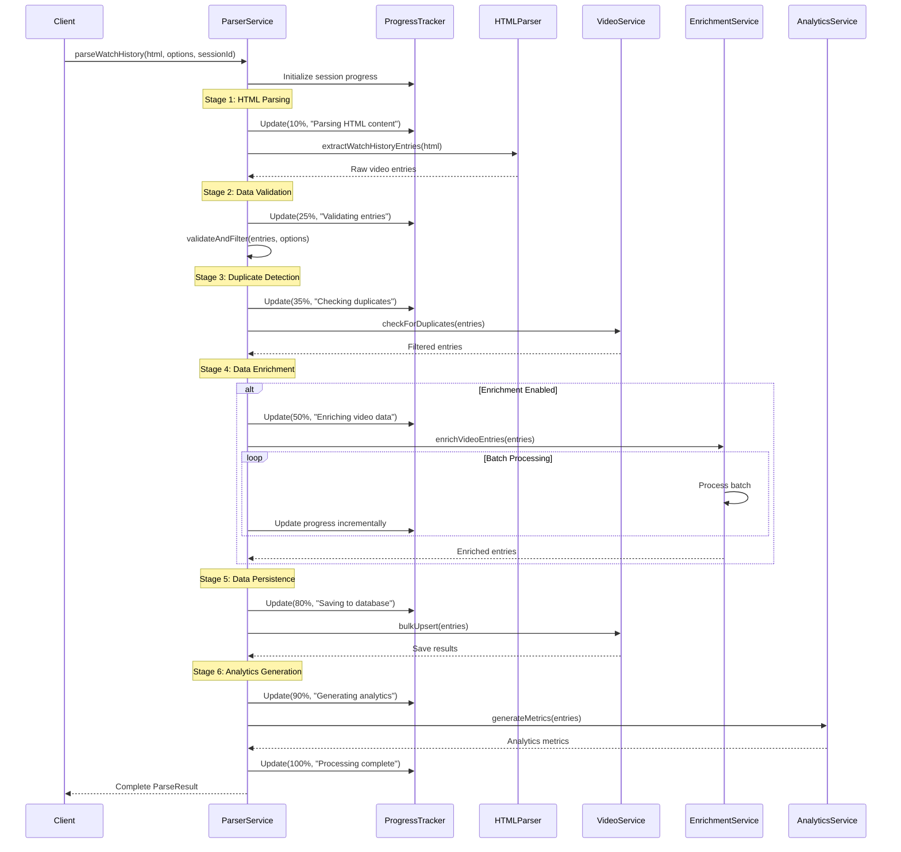
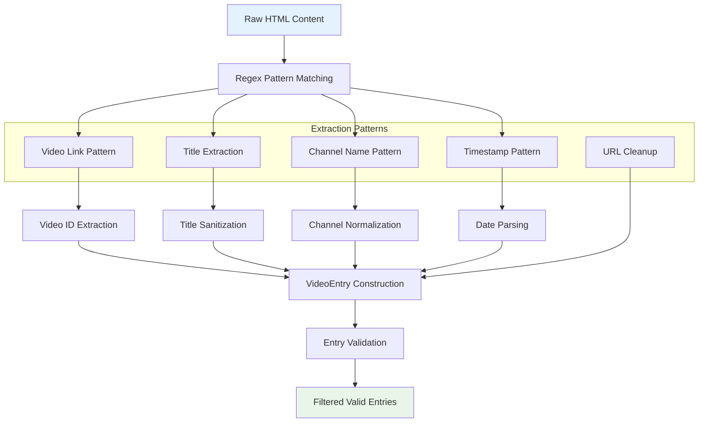
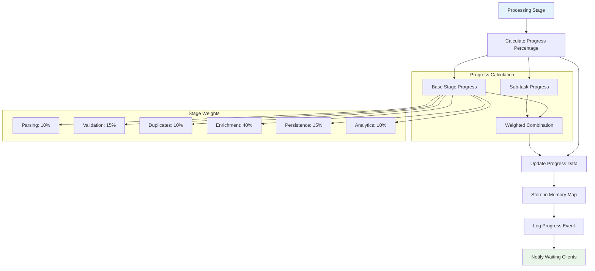
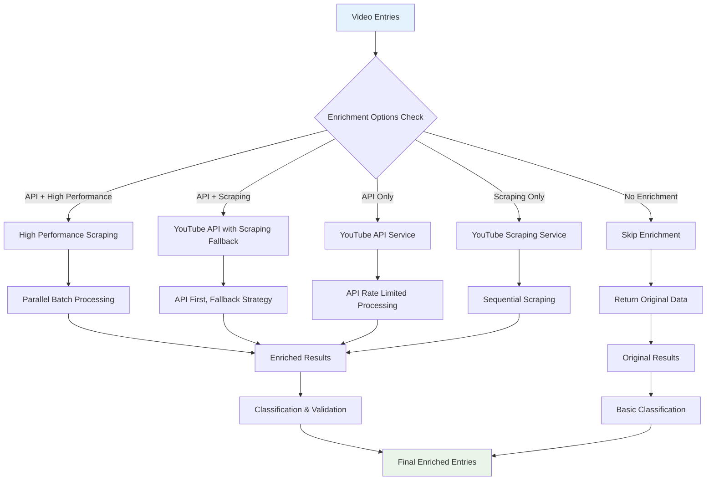
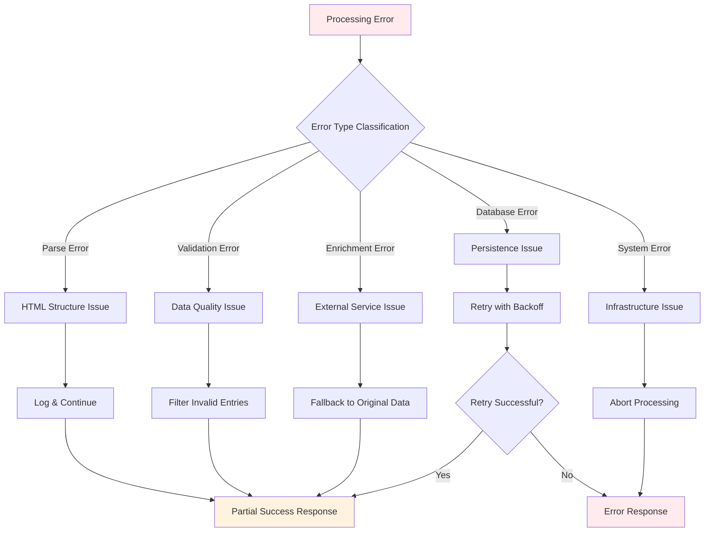
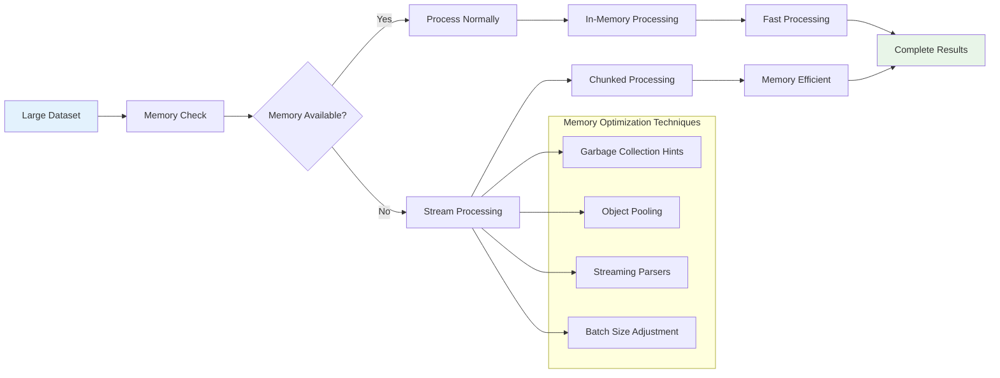
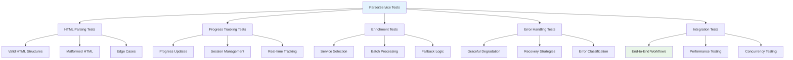

# ParserService Documentation

## Overview

The `ParserService` is the orchestration engine of the Rabbit YouTube Analytics Platform. It coordinates the entire data processing pipeline from HTML parsing through enrichment to analytics generation, while providing real-time progress tracking and comprehensive error handling.

## Service Architecture

```mermaid
graph TB
    subgraph "ParserService Core"
        MAIN[parseWatchHistory()]
        PROGRESS[Progress Tracking]
        SESSION[Session Management]
    end
    
    subgraph "Processing Stages"
        STAGE1[HTML Parsing & Extraction]
        STAGE2[Duplicate Detection]
        STAGE3[Data Enrichment]
        STAGE4[Data Persistence]
        STAGE5[Analytics Generation]
    end
    
    subgraph "Service Dependencies"
        VIDEO_SVC[VideoService]
        ANALYTICS_SVC[AnalyticsService]
        YT_API_SVC[YouTubeAPIService]
        YT_SCRAPING_SVC[YouTubeScrapingService]
        YT_HP_SCRAPING_SVC[YouTubeHighPerformanceScrapingService]
    end
    
    subgraph "Data Flow"
        HTML_INPUT[HTML Content]
        VIDEO_ENTRIES[VideoEntry Objects]
        ENRICHED_DATA[Enriched Data]
        METRICS_OUTPUT[Analytics Metrics]
    end
    
    MAIN --> STAGE1
    STAGE1 --> STAGE2
    STAGE2 --> STAGE3
    STAGE3 --> STAGE4
    STAGE4 --> STAGE5
    
    STAGE1 --> HTML_INPUT
    STAGE2 --> VIDEO_SVC
    STAGE3 --> YT_API_SVC
    STAGE3 --> YT_SCRAPING_SVC
    STAGE3 --> YT_HP_SCRAPING_SVC
    STAGE4 --> VIDEO_SVC
    STAGE5 --> ANALYTICS_SVC
    
    HTML_INPUT --> VIDEO_ENTRIES
    VIDEO_ENTRIES --> ENRICHED_DATA
    ENRICHED_DATA --> METRICS_OUTPUT
    
    MAIN --> PROGRESS
    PROGRESS --> SESSION
    
    style MAIN fill:#e3f2fd
    style HTML_INPUT fill:#e8f5e8
    style METRICS_OUTPUT fill:#e8f5e8
```

## Core Methods

### parseWatchHistory()

The main entry point that orchestrates the entire parsing and processing pipeline.

```typescript
public async parseWatchHistory(
  htmlContent: string, 
  options: ParseOptions, 
  sessionId?: string
): Promise<ParseResult>
```

#### Processing Pipeline



#### Performance Characteristics
- **Processing Speed**: ~500-1000 entries per second (depending on enrichment)
- **Memory Usage**: O(n) where n is the number of entries
- **Concurrent Sessions**: Supports multiple simultaneous processing sessions
- **Failure Recovery**: Graceful handling of partial failures

### extractWatchHistoryEntries()

Parses YouTube watch history HTML and extracts video entries using regex patterns.

```typescript
private extractWatchHistoryEntries(htmlContent: string): IVideoEntry[]
```

#### HTML Parsing Strategy



#### Regex Patterns Used

**Primary Video Entry Pattern:**
```typescript
const videoEntryPattern = /<a[^>]*href="https:\/\/www\.youtube\.com\/watch\?v=([^"&]+)[^"]*"[^>]*>([^<]+)<\/a>/g;
```

**Channel Name Pattern:**
```typescript
const channelPattern = /<a[^>]*href="https:\/\/www\.youtube\.com\/@[^"]*"[^>]*>([^<]+)<\/a>|<a[^>]*href="https:\/\/www\.youtube\.com\/channel\/[^"]*"[^>]*>([^<]+)<\/a>/g;
```

**Timestamp Pattern:**
```typescript
const timestampPattern = /<div[^>]*>\s*([A-Za-z]{3}\s+\d{1,2},\s+\d{4}),?\s*(\d{1,2}:\d{2}:\d{2}\s*[AP]M)?\s*<\/div>/g;
```

#### Parsing Algorithm Details

**Video ID Extraction:**
```typescript
private extractVideoId(url: string): string | null {
  const patterns = [
    /(?:youtube\.com\/watch\?v=|youtu\.be\/|youtube\.com\/embed\/)([a-zA-Z0-9_-]{11})/,
    /youtube\.com\/shorts\/([a-zA-Z0-9_-]{11})/,
    /youtube\.com\/live\/([a-zA-Z0-9_-]{11})/
  ];
  
  for (const pattern of patterns) {
    const match = url.match(pattern);
    if (match) return match[1];
  }
  
  return null;
}
```

**Date Parsing with Timezone Handling:**
```typescript
private parseWatchDate(dateString: string, timeString?: string): Date {
  try {
    // Handle various date formats from Google Takeout
    const cleanDateString = dateString.trim().replace(/,\s*$/, '');
    
    let fullDateString = cleanDateString;
    if (timeString) {
      fullDateString += ` ${timeString}`;
    }
    
    // Try multiple date formats
    const formats = [
      'MMM d, yyyy h:mm:ss a',
      'MMM d, yyyy',
      'MMMM d, yyyy',
      'yyyy-MM-dd HH:mm:ss'
    ];
    
    for (const format of formats) {
      try {
        const date = this.parseWithFormat(fullDateString, format);
        if (date && !isNaN(date.getTime())) {
          return date;
        }
      } catch (e) {
        continue;
      }
    }
    
    // Fallback to native Date parsing
    return new Date(fullDateString);
  } catch (error) {
    logger.warn(`Failed to parse date: ${dateString}`, { error });
    return new Date(); // Fallback to current date
  }
}
```

### Progress Tracking System

#### Progress Data Structure

```typescript
interface ProcessingProgress {
  sessionId: string;
  stage: string;
  progress: number; // 0-100
  message: string;
  details: {
    totalEntries?: number;
    processedEntries?: number;
    enrichedEntries?: number;
    errors?: number;
  };
  isComplete: boolean;
  error?: string;
}
```

#### Progress Update Algorithm



**Progress Update Implementation:**
```typescript
private updateProgress(
  sessionId: string, 
  stage: string, 
  progress: number, 
  message: string, 
  details: any = {}
): void {
  const progressInfo: ProcessingProgress = {
    sessionId,
    stage,
    progress: Math.min(100, Math.max(0, progress)),
    message,
    details,
    isComplete: progress >= 100,
    timestamp: new Date().toISOString()
  };
  
  this.progressData.set(sessionId, progressInfo);
  
  logger.info(`Progress [${sessionId}]: ${stage} (${progress}%) - ${message}`, {
    stage,
    progress,
    details
  });
  
  // Emit progress event for real-time updates
  this.eventEmitter.emit('progress', progressInfo);
}
```

### Data Enrichment Orchestration

#### Enrichment Strategy Selection



#### Enrichment Implementation

**Multi-Service Enrichment Strategy:**
```typescript
private async enrichVideoEntries(
  entries: IVideoEntry[], 
  options: ParseOptions,
  sessionId: string
): Promise<IVideoEntry[]> {
  const enrichmentTimer = createTimer('Video Enrichment');
  
  try {
    const videoIds = entries
      .map(entry => entry.videoId)
      .filter(id => id !== undefined) as string[];
    
    if (videoIds.length === 0) {
      this.updateProgress(sessionId, 'enrichment', 100, 'No videos to enrich');
      return entries;
    }
    
    // Determine enrichment service based on options
    let enrichmentService;
    if (options.useHighPerformanceService && this.youtubeHighPerformanceScraping) {
      enrichmentService = this.youtubeHighPerformanceScraping;
    } else if (options.useScrapingService && this.youtubeScraping) {
      enrichmentService = this.youtubeScraping;
    } else if (this.youtubeAPI) {
      enrichmentService = this.youtubeAPI;
    } else {
      logger.warn('No enrichment service available');
      return entries;
    }
    
    // Process in batches with progress updates
    const batchSize = options.useHighPerformanceService ? 50 : 20;
    const batches = this.chunkArray(videoIds, batchSize);
    const enrichedDataMap = new Map<string, any>();
    
    for (let i = 0; i < batches.length; i++) {
      const batch = batches[i];
      const batchProgress = (i / batches.length) * 100;
      
      this.updateProgress(
        sessionId, 
        'enrichment', 
        50 + (batchProgress * 0.3), 
        `Enriching batch ${i + 1}/${batches.length}`,
        { 
          batchNumber: i + 1, 
          totalBatches: batches.length,
          batchSize: batch.length 
        }
      );
      
      try {
        const batchResults = await enrichmentService.getVideoMetadata(batch);
        
        // Map results to video IDs
        batchResults.forEach((result, index) => {
          if (result && batch[index]) {
            enrichedDataMap.set(batch[index], result);
          }
        });
        
      } catch (error) {
        logger.warn(`Batch enrichment failed for batch ${i + 1}`, { error, batch });
        // Continue with next batch - don't fail entire enrichment
      }
    }
    
    // Apply enriched data to entries
    const enrichedEntries = entries.map(entry => {
      if (entry.videoId && enrichedDataMap.has(entry.videoId)) {
        const enrichedData = enrichedDataMap.get(entry.videoId);
        return {
          ...entry,
          ...enrichedData,
          enrichedWithAPI: true,
          enrichmentTimestamp: new Date()
        };
      }
      return entry;
    });
    
    const enrichedCount = enrichedEntries.filter(e => e.enrichedWithAPI).length;
    this.updateProgress(
      sessionId, 
      'enrichment', 
      80, 
      `Enriched ${enrichedCount}/${entries.length} videos`,
      { enrichedCount, totalCount: entries.length }
    );
    
    enrichmentTimer.end({ 
      success: true, 
      enrichedCount, 
      totalCount: entries.length,
      enrichmentRate: (enrichedCount / entries.length) * 100
    });
    
    return enrichedEntries;
    
  } catch (error) {
    enrichmentTimer.end({ success: false, error: error.message });
    logger.error('Video enrichment failed', { error, sessionId });
    
    this.updateProgress(
      sessionId, 
      'enrichment', 
      80, 
      'Enrichment failed, continuing with original data',
      { error: error.message }
    );
    
    return entries; // Return original entries on failure
  }
}
```

### Error Handling & Recovery

#### Error Classification System



#### Recovery Strategies

**Graceful Degradation Implementation:**
```typescript
private async handleProcessingError(
  error: Error, 
  stage: string, 
  sessionId: string,
  partialData?: any
): Promise<ParseResult> {
  logger.error(`Processing error in stage: ${stage}`, { 
    error: error.message, 
    sessionId, 
    stage 
  });
  
  this.updateProgress(
    sessionId, 
    stage, 
    -1, 
    `Error in ${stage}: ${error.message}`,
    { error: error.message, stage }
  );
  
  // Determine recovery strategy based on stage and error type
  switch (stage) {
    case 'parsing':
      return this.createErrorResult('HTML parsing failed', [], error);
      
    case 'enrichment':
      // Continue with non-enriched data
      if (partialData) {
        logger.info('Continuing with non-enriched data after enrichment failure');
        return await this.continueWithBasicData(partialData, sessionId);
      }
      break;
      
    case 'persistence':
      // Return analytics without saving to database
      if (partialData) {
        logger.info('Returning analytics without persistence after DB failure');
        return await this.generateAnalyticsOnly(partialData, sessionId);
      }
      break;
      
    default:
      return this.createErrorResult(`Processing failed in ${stage}`, [], error);
  }
  
  // Default error response
  return this.createErrorResult('Processing failed', [], error);
}
```

### Performance Optimization

#### Memory Management



**Large Dataset Processing:**
```typescript
private async processLargeDataset(
  htmlContent: string, 
  options: ParseOptions,
  sessionId: string
): Promise<ParseResult> {
  const memoryUsage = process.memoryUsage();
  const availableMemory = (os.totalmem() - memoryUsage.rss) / 1024 / 1024; // MB
  
  // If HTML content is very large or memory is limited, use streaming
  if (htmlContent.length > 50 * 1024 * 1024 || availableMemory < 500) {
    logger.info('Using streaming processing for large dataset', {
      htmlSize: htmlContent.length,
      availableMemory,
      sessionId
    });
    
    return await this.streamingParse(htmlContent, options, sessionId);
  }
  
  return await this.parseWatchHistory(htmlContent, options, sessionId);
}

private async streamingParse(
  htmlContent: string, 
  options: ParseOptions,
  sessionId: string
): Promise<ParseResult> {
  const CHUNK_SIZE = 10 * 1024 * 1024; // 10MB chunks
  const chunks = this.splitIntoChunks(htmlContent, CHUNK_SIZE);
  
  let allEntries: IVideoEntry[] = [];
  let totalProcessed = 0;
  
  for (let i = 0; i < chunks.length; i++) {
    const chunk = chunks[i];
    const chunkProgress = (i / chunks.length) * 30; // Parsing is 30% of total
    
    this.updateProgress(
      sessionId,
      'parsing',
      chunkProgress,
      `Processing chunk ${i + 1}/${chunks.length}`,
      { chunkNumber: i + 1, totalChunks: chunks.length }
    );
    
    const chunkEntries = this.extractWatchHistoryEntries(chunk);
    allEntries = allEntries.concat(chunkEntries);
    totalProcessed++;
    
    // Force garbage collection hint
    if (global.gc && i % 10 === 0) {
      global.gc();
    }
  }
  
  // Continue with normal processing
  return await this.continueProcessing(allEntries, options, sessionId);
}
```

### Testing Strategy

#### Unit Testing Architecture



#### Test Data Strategies

**Mock HTML Generation:**
```typescript
describe('ParserService HTML Parsing', () => {
  const generateMockHTML = (entryCount: number): string => {
    const entries = Array.from({ length: entryCount }, (_, i) => `
      <div>
        <a href="https://www.youtube.com/watch?v=test${i}">Test Video ${i}</a>
        <a href="https://www.youtube.com/@testchannel${i}">Test Channel ${i}</a>
        <div>Jan ${i + 1}, 2024, 12:00:00 PM</div>
      </div>
    `).join('');
    
    return `<html><body>${entries}</body></html>`;
  };
  
  it('should parse multiple video entries correctly', async () => {
    const mockHTML = generateMockHTML(100);
    const result = await parserService.parseWatchHistory(mockHTML, defaultOptions);
    
    expect(result.entries).toHaveLength(100);
    expect(result.entries[0]).toMatchObject({
      title: 'Test Video 0',
      channel: 'Test Channel 0',
      videoId: 'test0'
    });
  });
});
```

The ParserService provides comprehensive orchestration of the YouTube analytics pipeline with robust error handling, real-time progress tracking, and optimized performance for large-scale data processing.